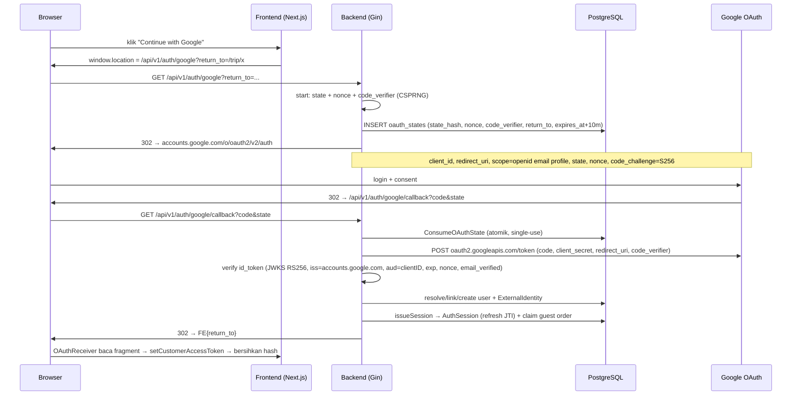

# Google OAuth — "Continue with Google"

> Status: **FITUR AKTIF** (19 Agu 2026), di belakang feature-flag `GOOGLE_OAUTH_ENABLED`
> (default `false`). Dokumen ini adalah referensi lengkap implementasi Google OAuth di
> VeroAiTravelAgents: arsitektur, alur, konfigurasi, keamanan, pengembangan lokal, dan
> deployment. Untuk rencana awal & keputusan desain lihat
> [GOOGLE_OAUTH_PLAN.md](GOOGLE_OAUTH_PLAN.md); ringkasan & batasan juga ada di
> [docs/ai/known-issues.md](ai/known-issues.md) bagian A.14.

## Ringkasan

Google OAuth ditambahkan sebagai **provider autentikasi tambahan** pada auth yang sudah
ada (email/password + JWT access/refresh). Google hanya memverifikasi identitas pemakai;
**Vero tetap pemilik** `User`, `AuthSession`, JWT, role, authorization, logout, dan
revokasi. Hasil akhir login Google adalah **sesi Vero yang normal** — `AuthService.issueSession`
yang sama dengan login/register password — sehingga rotasi refresh token, reuse detection,
logout, dan revoke bekerja identik.

Implementasinya adalah **Authorization Code Flow + PKCE (S256)**, server-side
(*confidential client*), memakai library resmi:

- `golang.org/x/oauth2` → tukar authorization code di token endpoint Google.
- `github.com/coreos/go-oidc/v3` → verifikasi `id_token` (signature RS256 via JWKS dari
  OIDC discovery document, issuer, audience, expiry). **Tidak ada crypto/JWT manual.**

Endpoint Google OAuth berbasis **redirect (bukan JSON envelope)**: mereka full-page
navigation. Access token dikirim ke frontend lewat **URL fragment** (`#access_token=...`),
refresh token lewat cookie HttpOnly pada respons 302.

---

## 1. Arsitektur

### 1.1 Prinsip

1. **Provider tambahan, bukan pengganti.** Alur email/password, guest order limit, dan
   middleware auth TIDAK berubah.
2. **Sesi Vero normal.** Tidak ada jalur sesi khusus Google; sesi Google dibuat lewat
   `AuthService.issueSession` yang sama (akses ke `issueSession` internal karena satu package).
3. **Identitas dikunci oleh `sub`, BUKAN email.** Satu akun Google (`sub`) → satu akun Vero,
   dijamin constraint `UNIQUE(provider, provider_user_id)` pada tabel `external_identities`.
4. **Tanpa auto-merge email.** Email yang sudah punya akun password TIDAK otomatis di-merge;
   linking hanya lewat alur eksplisit yang mengharuskan bukti kepemilikan akun Vero
   (anti account-takeover, SEC-24).
5. **Fail-closed + feature-flag.** Bila `GOOGLE_OAUTH_ENABLED=false` atau discovery gagal,
   endpoint membalas 404 dan tidak ada dependensi jaringan.
6. **Google hanya untuk customer.** Role `operator`/`admin` hanya bisa dibuat lewat
   `POST /admin/users`; Google tidak pernah bisa memilih role (SEC-1). Backoffice tidak
   memakai Google.

### 1.2 Komponen dan path file

| Komponen | Path | Tanggung jawab |
|---|---|---|
| `GoogleClient` (OIDC client) | `backend/internal/auth/google.go` | Discovery OIDC, pembuatan URL consent (`AuthCodeURLForRedirect`), exchange code (`ExchangeForRedirect`), verifikasi id_token. Issuer pinned `https://accounts.google.com`. Scope minimal `openid email profile` |
| `GoogleOAuthService` | `backend/internal/services/google_oauth_service.go` | `StartLogin`, `Callback`, `resolveUser`, `LinkAccount`, `sanitizeReturnTo` (open-redirect guard), `hashOAuthState`, `randomURLToken`, `pkceS256Challenge`; emit audit event |
| Handler | `backend/internal/handlers/google_auth_handlers.go` | Redirect-based (`302`), bukan JSON: `GoogleLogin`, `GoogleLinkStart`, `GoogleCallback`; set refresh cookie; claim guest order; redirect error `auth_error` |
| Repository | `backend/internal/repositories/oauth_repository.go` | `CreateOAuthState`, `ConsumeOAuthState` (atomik single-use), `DeleteExpiredOAuthStates`, `FindUserByGoogleSub`, `CreateUserWithGoogleIdentity`, `LinkUserGoogleSub` |
| Model | `backend/internal/models/models.go` | `OAuthState`, `ExternalIdentity`, `User.GoogleSub` (mirror denormalisasi) |
| Rute | `backend/internal/routes/routes.go` | Grup `/api/v1/auth` (kena `AuthRateLimit` 5 req/dtk) |
| Wiring | `backend/internal/services/services.go` | `s.Google = NewGoogleOAuthService(cfg, repo, s.Auth)` |
| Config | `backend/internal/config/config.go` | Load env + `Validate()` guard produksi + `deriveGoogleLinkRedirectURI` |
| Migrasi | `backend/migrations/20260818_google_oauth.sql` + `database.go migrateGoogleOAuth()` | Tabel `oauth_states`, `external_identities`, kolom `users.google_sub` + index parsial unik |
| Frontend | `frontend/src/components/auth/GoogleButton.tsx`, `OAuthReceiver.tsx`, `frontend/src/lib/api.ts` | Tombol "Continue with Google", pembaca fragment `#access_token`, helper sesi customer |

### 1.3 Skema data relevan

- **`oauth_states`** — satu baris per percobaan login. Hanya **SHA-256 hash** dari `state`
  yang disimpan (`state_hash`), plus `nonce`, `code_verifier` (PKCE, server-side only),
  `return_to` (sudah divalidasi), `expires_at` (TTL 10 menit), `consumed_at` (anti-replay),
  `link_user_id` (diisi hanya untuk alur link).
- **`external_identities`** — **sumber kebenaran** link user→Google: `user_id`, `provider`
  (`"google"`), `provider_user_id` (`sub`). `UNIQUE(provider, provider_user_id)` menjamin
  satu Google `sub` → satu akun Vero. `email`/`picture` hanya informasional.
- **`users.google_sub`** — denormalized fast-path mirror, unik parsial
  (`idx_users_google_sub WHERE google_sub IS NOT NULL`), ditulis atomik satu transaksi
  dengan `external_identities`.

### 1.4 Diagram alur (login)



### 1.5 Titik integrasi Google (dari sisi library)

| Endpoint Google | Dipakai untuk | Diresolusi dari |
|---|---|---|
| `https://accounts.google.com/.well-known/openid-configuration` | Discovery OIDC (dilakukan sekali saat startup bila feature enabled) | konstanta `googleIssuer` |
| `https://accounts.google.com/o/oauth2/v2/auth` | URL consent (authorize) | `oidc.Provider.Endpoint()` |
| `https://oauth2.googleapis.com/token` | Tukar authorization code → `id_token` + `access_token` | sda |
| `https://www.googleapis.com/oauth2/v3/certs` | JWKS untuk verifikasi RS256 id_token | discovery document |

## 2. OAuth Flow

### 2.1 Endpoint

Grup `/api/v1/auth` (semua endpoint di sini sudah otomatis kena `AuthRateLimit`,
±5 req/detik per-IP).

| Method | Path | Akses | Fungsi |
|---|---|---|---|
| GET | `/api/v1/auth/google?return_to=<path>` | 🔓 publik | **Login flow start.** 302 ke consent Google. Bila disabled → 404 |
| GET | `/api/v1/auth/google/callback?code&state` | 🔓 publik | **Login flow callback.** Verifikasi, resolve/link/create user, issue sesi, redirect ke FE |
| GET | `/api/v1/auth/google/link?return_to=<path>` | 🔒 `Auth` (JWT) | **Link flow start.** Stampa `link_user_id` pada state, 302 ke consent Google |
| GET | `/api/v1/auth/google/link/callback?code&state` | 🔓 publik | **Link flow callback.** Handler sama dengan `/google/callback`; `link_user_id` pada state memilih cabang linking |

> Catatan: jalur `/auth/google/login` lama direname menjadi `/auth/google` pada 24 Agu 2026.

### 2.2 Alur login (step-by-step)

1. **Start.** Frontend `GoogleButton.tsx` melakukan full-page navigation
   `window.location.href = /api/v1/auth/google?return_to=<pathSaatIni>`
   (bukan `apiFetch`: browser harus mengikuti redirect consent Google). `return_to`
   berisi path + query halaman saat ini sehingga user kembali ke halaman asal.
2. **`GoogleOAuthService.StartLogin`** (di `GoogleLogin` handler):
   - Generate `state` dan `nonce` (masing-masing 32 byte acak CSPRNG, base64url).
   - Generate `code_verifier` (64 byte CSPRNG) untuk **PKCE S256**; hanya
     `code_challenge` yang dikirim ke Google.
   - Simpan satu baris `oauth_states`: `state_hash` (**SHA-256** dari state raw),
     `nonce`, `code_verifier`, `return_to` (sudah lewat `sanitizeReturnTo`),
     `expires_at` = now + 10 menit, `link_user_id` (nilai `nil` untuk login).
   - Emit audit `google_login_started` (`flow=login`).
   - Redirect `302` ke
     `https://accounts.google.com/o/oauth2/v2/auth?client_id=...&redirect_uri=...&scope=openid+email+profile&state=...&nonce=...&code_challenge=...&code_challenge_method=S256&response_type=code`.
     Redirect URI yang dipakai = `GOOGLE_REDIRECT_URI` (`callbackRedirectURI(false)`).
3. **Google** menampilkan login + consent, lalu me-302 ke
   `/api/v1/auth/google/callback?code=<auth_code>&state=<state>` (bisa juga
   `?error=access_denied` bila user menolak).

4. **Callback (backend):**
   - Bila query `error` ada → redirect error `auth_error=access_denied`.
   - Bila `code` atau `state` kosong → `auth_error=missing_params`.
   - `GoogleOAuthService.Callback`:
     a. `ConsumeOAuthState(stateHash)` — **atomik single-use** via satu UPDATE
        `consumed_at` (`rowsAffected==1` hanya untuk pemenang race; state yang sudah
        dipakai / kedaluwarsa / tidak dikenal ditolak). Emit
        `google_oauth_state_invalid` bila tidak valid.
     b. `ExchangeForRedirect` dengan **redirect URI yang sama** seperti saat start
        (token endpoint menolak `redirect_uri` berbeda) → POST
        `https://oauth2.googleapis.com/token` dengan
        `code`, `client_id`, `client_secret`, `redirect_uri`, `grant_type=authorization_code`,
        dan `code_verifier` (PKCE).
     c. Verifikasi `id_token`:
        - `go-oidc` `verifier.Verify`: signature **RS256** via JWKS (di-cache + dirotasi
          library), `iss` pinned `https://accounts.google.com` (ada juga double-check
          manual defense-in-depth), `aud` == `GOOGLE_CLIENT_ID`, `exp` belum lewat.
        - Di atas verifikasi library: `nonce` == nonce dari state row
          (`ErrGoogleNonceMismatch`), `sub` + `email` tidak kosong, dan
          **`email_verified` wajib `true`** (`ErrGoogleEmailUnverified`).
     d. Bila state ber-`link_user_id` → cabang **linking**: `LinkAccount` (tidak ada
        sesi baru), redirect FE `?google_linked=1`.
     e. Selain itu → **login**: `resolveUser(identity)` → `AuthService.issueSession(user)`
        → audit `google_login_success`.
   - Sukses login (handler):
     a. **Claim guest order**: baca cookie `vero_guest_session` →
        `Guests.ClaimOrder` ke user yang baru login (sama seperti login/register password).
     b. `auth.SetRefreshCookie(c, cfg, refreshToken, maxAge=refreshTTL)` → cookie
        `refresh_token` **HttpOnly**, path `/api/v1/auth`.
     c. Redirect `302` ke
        `{GOOGLE_OAUTH_FRONTEND_URL}{return_to}#access_token=...&token_type=Bearer&expires_in=...&provider=google`.
        Access token berada di **URL fragment** — tidak pernah dikirim ke server maupun
        masuk access log.
5. **Frontend `OAuthReceiver.tsx`** (dipasang di `/login`, `/register`, `trip/[id]`):
   - Baca `#access_token` dari fragment, simpan via `setCustomerAccessToken`
     (localStorage `vero_customer_access_token`).
   - Bersihkan hash dengan `history.replaceState`, lalu `window.location.replace`
     ke path bersih → halaman di-render ulang dalam keadaan login.
   - Bila ada `?auth_error=<code>` → tampilkan pesan ramah lewat `oauthErrorMessage()`.

### 2.3 Kode error `auth_error` (apa yang dikirim ke FE)

| Kode | Penyebab | Pesan FE |
|---|---|---|
| `access_denied` | User membatalkan / Google menolak consent | "Google sign-in was cancelled..." |
| `start_failed` | Gagal memulai (backend error) | "Could not start Google sign-in..." |
| `missing_params` | Callback tanpa `code`/`state` (state hilang/kedaluwarsa) | "Google sign-in was interrupted..." |
| `authentication_failed` | State invalid/expired, gagal exchange, atau verifikasi id_token gagal | "Google sign-in could not be completed..." |
| `account_exists_link_required` | Email sudah punya akun password, sub belum ter-link (refuse auto-merge) | "An account with this email already exists. Please log in with your email and password." |
| `google_identity_taken` | `sub` sudah ter-link ke akun lain | "This Google account is already linked to another user." |

Raw error internal **tidak pernah** sampai ke client (SEC-15); hanya kode kategori yang
stabil dan aman.

## 3. Environment Variables

Sumber kebenaran: `backend/internal/config/config.go` (fungsi `Load()`); contoh siap pakai
di `backend/.env.example`.

| Variabel | Default | Keterangan |
|---|---|---|
| `GOOGLE_OAUTH_ENABLED` | `false` | Feature flag. `true` → resolve provider OIDC saat startup + endpoint aktif. `false` → endpoint 404 tanpa dependensi jaringan (graceful degradation, pola sama dengan `PAYMENTS_ENABLED`) |
| `GOOGLE_CLIENT_ID` | _(kosong)_ | Client ID dari Google Cloud Console (OAuth client "Web application"). Bisa didapat di halaman Credentials |
| `GOOGLE_CLIENT_SECRET` | _(kosong)_ | Client secret. **Rahasia server-only** — tidak pernah ke browser/VCS. Bila enabled di production dan kosong → `Config.Validate()` menolak start |
| `GOOGLE_REDIRECT_URI` | `http://localhost:8080/api/v1/auth/google/callback` | Redirect URI login flow. **Canonical**; alias `GOOGLE_REDIRECT_URL` juga diterima (URI menang bila keduanya di-set). Harus terdaftar persis di Google Cloud Console |
| `GOOGLE_LINK_REDIRECT_URI` | derive dari `GOOGLE_REDIRECT_URI` → `…/auth/google/link/callback` | Redirect URI link flow. Opsional: bila tidak di-set, diturunkan otomatis dengan mengubah sufiks `/auth/google/callback` → `/auth/google/link/callback`. Juga wajib terdaftar di Console |
| `GOOGLE_OAUTH_FRONTEND_URL` | `http://localhost:3000` | **Origin** frontend customer untuk redirect final + basis validasi `return_to` (open-redirect guard). TIDAK pernah diambil dari request |

### 3.1 Validasi produksi (`Config.Validate()`)

Ketika `APP_ENV=production` dan `GOOGLE_OAUTH_ENABLED=true`:

- `GOOGLE_CLIENT_ID` dan `GOOGLE_CLIENT_SECRET` **wajib** terisi (gagal start bila kosong).
- `GOOGLE_REDIRECT_URI`, `GOOGLE_LINK_REDIRECT_URI`, dan `GOOGLE_OAUTH_FRONTEND_URL`
  **tidak boleh mengandung `localhost`** (default dev akan membuat user terdampar;
  pola guard yang sama dengan SEC-4/DOKU).

> Legacy: variabel `GOOGLE_REDIRECT_URL` diterima sebagai alias `GOOGLE_REDIRECT_URI`
> untuk kenyamanan operator (23 Agu 2026). `GOOGLE_REDIRECT_URI` yang dipakai bila kedua
> duanya di-set (`getEnvFirst`).

### 3.2 Contoh `.env` development

```dotenv
GOOGLE_OAUTH_ENABLED=true
GOOGLE_CLIENT_ID=xxxxxxxx.apps.googleusercontent.com
GOOGLE_CLIENT_SECRET=GOCSPX-xxxxxxxxxxxxxxxx
GOOGLE_REDIRECT_URI=http://localhost:8080/api/v1/auth/google/callback
GOOGLE_OAUTH_FRONTEND_URL=http://localhost:3000
# GOOGLE_LINK_REDIRECT_URI=http://localhost:8080/api/v1/auth/google/link/callback
```

> JANGAN pernah commit client id/secret asli ke VCS (lihat `backend/.env.example`).

## 4. Google Cloud Console Configuration

Konfigurasi dibuat di console cloud: **https://console.cloud.google.com** — API →
Credentials → OAuth consent screen.

### 4.1 Pilih / buat project

- Buka konsol, buat **project terpisah untuk environment** (`vero-travel-dev`,
  `vero-travel-prod`). Project dev dan prod sebaiknya berbeda agar test users, redirect
  URI, dan kredensial tidak tercampur.
- Aktifkan **Google Identity Services** atau setidaknya pastikan OAuth consent screen
  tersedia (Google otomatis mengaktifkannya saat mengakses menu OAuth).

### 4.2 OAuth consent screen

Menu: **APIs & Services → OAuth consent screen**.

1. **User type**: pilih `External` (aplikasi dipakai oleh publik / akun di luar org).
   `Internal` hanya berfungsi untuk pengguna dalam Google Workspace yang sama.
2. **App information**:
   - **App name**: mis. `Vero Travel`.
   - **User support email**: email yang bisa dihubungi user.
   - **App logo** (opsional): ikon "G" resmi boleh dipakai dengan aturan Google.
   - **App domain**: isi bila sudah punya domain produksi (homepage, privacy policy,
     terms of service). Untuk dev tidak wajib.
3. **Audience**: tambahkan **Test users** (email Google penguji). Selama status
   **Testing**, hanya akun ini yang boleh login (`Error 403: access_denied` untuk
   akun lain).
4. **Authorized domains** (bagian ini di halaman consent, bukan credentials):
   - Dev: tidak wajib.
   - Production: tambahkan domain API & FE, mis. `api.example.com` dan `example.com`.
5. **Scopes** — biarkan default OIDC minimal:
   - `openid` (OpenID Connect)
   - `email` (Email — melihat alamat email utama)
   - `profile` (Profile — melihat informasi profil dasar)
   Backend hanya meminta 3 scope ini (`googleScopes`), jadi tidak perlu menambah scope
   API Google apa pun.
6. **Publish status**:
   - Saat pengembangan: tetap **Testing** (aman).
   - Siap produksi: klik **Publish app** → status **In production**. Tanpa publish,
     user non-test akan ditolak. Note: publikasi bisa memicu **verifikasi** hanya bila
     memakai scope sensitif/restricted; scope `email`/`profile`/`openid` tidak sensitif,
     jadi umumnya **tidak perlu** verifikasi aplikasi.

### 4.3 Kredensial (OAuth client)

Menu: **APIs & Services → Credentials → Create credentials → OAuth client ID**.

1. **Application type**: pilih **Web application** (ini alur server-side; bukan
   "Desktop app" / "Android" / "iOS").
2. **Name**: mis. `vero-travel-backend-dev`.
3. **Authorized redirect URIs** — daftar **exact match** dari setiap callback backend:

   Dev:
   ```
   http://localhost:8080/api/v1/auth/google/callback
   http://localhost:8080/api/v1/auth/google/link/callback
   ```

   Production (contoh domain `api.example.com`):
   ```
   https://api.example.com/api/v1/auth/google/callback
   https://api.example.com/api/v1/auth/google/link/callback
   ```

   > Kedua URI **wajib** terdaftar (login flow menggunakan `/google/callback`, link flow
   > menggunakan `/google/link/callback`). Google membandingkan **string persis** termasuk
   > skema, host, port, dan path. Tidak ada wildcard. `http://localhost` (port `8080`)
   > diizinkan untuk develop; produksi harus `https`.

4. **Authorized JavaScript origins** (opsional untuk aplikasi Web): isi origin frontend
   agar Google tidak memicu warning origin yang tidak dikenal, mis. `http://localhost:3000`
   (dev) dan `https://example.com` (prod). Untuk flow server-side yang memakai redirect
   URI, JS origins tidak wajib, tapi mengisinya praktik yang baik.
5. Klik **Create**. Salin:
   - **Client ID** → `GOOGLE_CLIENT_ID`
   - **Client secret** → `GOOGLE_CLIENT_SECRET` (jangan pernah disimpan di repo /
     dikirim ke browser / masuk log).

### 4.4 Rotasi / manajemen secret

- Gol yang sama punya **dua variasi kredensial** (client ID tetap, secret bisa
  di-reset). Untuk rotasi secret: buat kredensial baru → deploy → hapus yang lama
  (atau pakai fitur *Download JSON* untuk backup yang aman).
- Pantau halaman Credentials untuk **OAuth consent screen audit logs** yang menampilkan
  aktivitas consent tiap user.

### 4.5 Audit / verifikasi Google

- Scope `openid email profile` termasuk scope **tidak sensitif**, jadi aplikasi **tidak
  perlu** menjalani proses verifikasi Google. Cukup klik **Publish app** saat siap
  produksi (publikasi hanya memicu verifikasi bila ada scope sensitif/restricted).
- Pantau aktivitas consent lewat **OAuth consent screen audit logs** di bagian Credentials.

## 5. Redirect URI

### 5.1 Dua URI yang digunakan

Backend menangani **dua alur** dengan callback berbeda, dan token endpoint Google
mewajibkan `redirect_uri` saat exchange = persis `redirect_uri` di request authorize.
Karena itu diperlukan **dua registered redirect URI**:

| Flow | Path callback | Variabel env | Arahan default |
|---|---|---|---|
| Login | `/api/v1/auth/google/callback` | `GOOGLE_REDIRECT_URI` (alias `GOOGLE_REDIRECT_URL`) | `http://localhost:8080/api/v1/auth/google/callback` |
| Link | `/api/v1/auth/google/link/callback` | `GOOGLE_LINK_REDIRECT_URI` | derive: ubah sufiks `/auth/google/callback` → `/auth/google/link/callback` |

`callbackRedirectURI(linkFlow)` memilih URI yang tepat saat build consent URL dan saat
exchange — nilai yang sama digunakan di kedua titik sehingga token endpoint tidak menolak
(`redirect_uri_mismatch`).

### 5.2 Aturan penting

1. **Exact match.** URI di environment harus **identik** dengan yang terdaftar di
   Google Cloud Console — termasuk `https://` vs `http://`, host, port, dan path (case
   sensitive pada path). Trailing slash juga berarti URI berbeda.
2. **No wildcard.** Google tidak mengizinkan `*` / domain wildcard dalam redirect URI.
3. **`localhost` khusus dev.** Google mengizinkan `http://localhost:<port>` tanpa TLS
   untuk development. Di production `Config.Validate()` **menolak start** bila redirect
   URI masih mengandung `localhost`.
4. **Daftarkan kedua URI** di OAuth client yang sama (Web application). Lupa mendaftarkan
   link URI akan membuat alur "Link Google Account" gagal di langkah exchange ketika
   user sudah sampai di consent screen.

### 5.3 Templat per environment

| Environment | `GOOGLE_REDIRECT_URI` |
|---|---|
| Dev | `http://localhost:8080/api/v1/auth/google/callback` |
| Staging | `https://api-staging.example.com/api/v1/auth/google/callback` |
| Production | `https://api.example.com/api/v1/auth/google/callback` |

`GOOGLE_LINK_REDIRECT_URI` mengikuti pola: ganti `callback` → `link/callback`
(mis. `https://api.example.com/api/v1/auth/google/link/callback`). Bila domain publik
backend dibalik proxy/load balancer, gunakan **URL publik yang dilihat browser**
(browser & Google tidak tahu domain internal).

## 6. Account Creation (Google signup pertama kali)

Dilakukan oleh `resolveUser` di cabang "tidak ada match" (sub maupun email belum dikenal),
lalu di-persist oleh `CreateUserWithGoogleIdentity` dalam **satu transaksi**:

1. Generate password acak **16 byte CSPRNG** (hex) → `bcrypt.GenerateFromPassword`
   (cost default). Password ini **tidak pernah bisa dipakai** untuk login password —
   hanya memenuhi constraint `users.password NOT NULL` (pola SEC-24). User login
   selanjutnya selalu via Google.
2. `name` dari claim `name` Google; bila kosong, pakai bagian lokal email
   (`strings.Split(email, "@")[0]`).
3. `role` = **`models.RoleUser` hardcoded server-side** — klaim Google **tidak pernah**
   menentukan role (SEC-1). Tidak ada jalur untuk menjadi operator/admin lewat Google.
4. `users.google_sub` di-set ke `sub`, dan row `external_identities`
   (`provider="google"`, `provider_user_id=sub`) dibuat — **source of truth** identitas
   untuk login berikutnya.
5. Audit `google_account_created` di-emit.

**Race condition** (dua callback paralel, atau `POST /auth/register` paralel dengan
email sama): constraint unique membuat `CreateUserWithGoogleIdentity` gagal.
Fallback **hanya** resolve lewat kunci identitas yang sama seperti lookup utama —
`FindUserByGoogleSub`. Bila `sub` masih belum ter-link, artinya create kalah pada
`users.email` UNIQUE milik akun yang BUKAN identitas Google ini, dan hasilnya
adalah keputusan yang sama seperti guard pra-create: `ErrGoogleAccountExists` +
audit `google_link_required` (`reason=create_race_email_taken`). Fallback lewat
`FindUserByEmail` (perilaku lama, P1-H1) DIHAPUS: ia mengembalikan akun password
yang belum pernah menautkan `sub` tersebut, melewati guard anti-merge, dan
—karena claim guest order jalan tepat setelah callback— memindahkan order guest
si pemanggil ke akun korban. Kegagalan create yang bukan lost-race (mis. DB down)
tetap diteruskan sebagai error (fail closed). Dikunci
`internal/services/identity_resolution_race_test.go`.

---

## 7. Account Linking

### 7.1 Kebijakan resolusi (`resolveUser`)

1. **`sub` match** (via `external_identities`) → langsung login ke akun yang sudah
   ter-link. Ini jalur normal "login kedua kali".
2. **Email match, tapi `sub` belum ter-link** → **DITOLAK** (`ErrGoogleAccountExists`,
   audit `google_link_required`). Alasan (anti account-takeover, SEC-24): siapa pun yang
   bisa memproduksi Google token untuk satu email yang belum tentu benar-benar
   dimilikinya tidak boleh otomatis membajak akun password yang sudah ada. User harus
   membuktikan kepemilikan akun Vero dulu (login password) lalu **menautkan secara
   eksplisit** via alur `/auth/google/link`.
3. **Tidak ada match sama sekali** → buat akun baru (lihat bagian 6).

### 7.2 Alur "Link Google Account" eksplisit

Endpoint: `GET /api/v1/auth/google/link` — **wajib melalui middleware `Auth`**
(pengguna harus sudah login, akses token valid). Ini menjamin si pemanggil adalah pemilik
TERBUKTI akun Vero tersebut.

1. `GoogleLinkStart` membaca `user_id` dari konteks auth, lalu panggil
   `StartLogin(returnTo, &userID)` → state di-stamp `oauth_states.link_user_id`.
   Redirect URI untuk alur ini = `GOOGLE_LINK_REDIRECT_URI`.
2. Google consent → callback `/api/v1/auth/google/link/callback` (handler yang sama
   dengan `GoogleCallback`; cabang dipilih dari `link_user_id` yang ada di state).
3. `LinkAccount(userID, identity, meta)`:
   - `sub` sudah ter-link ke akun **lain** → `ErrGoogleIdentityTaken`
     (`auth_error=google_identity_taken`). Satu Google `sub` tidak bisa pindah antar
     akun Vero.
   - `sub` sudah ter-link ke akun **ini** → no-op idempotent (kembalikan user apa adanya).
   - selain itu → `LinkUserGoogleSub`: buat row `external_identities` +
     update `users.google_sub` (mirror) dalam **satu transaksi**. Audit
     `google_account_linked`. **Tidak menyentuh password/role.**
   - **Lost race pada write (4 Sep 2026)**: cek "sudah ter-link?" adalah READ dan
     `LinkUserGoogleSub` adalah WRITE, jadi link paralel untuk `sub` yang sama
     bisa masuk di antaranya. `UNIQUE(provider, provider_user_id)` yang memutuskan
     pemenang; yang kalah **resolve ulang lewat kunci yang sama** (`FindUserByGoogleSub`)
     dan mengembalikan keputusan yang identik dengan pra-cek: akun lain →
     `ErrGoogleIdentityTaken`, akun sendiri → no-op idempotent. Kegagalan write
     tanpa pemilik `sub` yang terlihat tetap diteruskan sebagai error.
     Dikunci `internal/services/identity_resolution_race_test.go`.
4. Sukses → redirect FE `?google_linked=1` (tanpa sesi baru; user sudah login).

### 7.3 Mengapa tidak auto-merge?

Email **mutable** dan bisa didaftarkan oleh orang lain di masa depan; `sub` **immutable**
dan dibuktikan oleh id_token yang memuat `email_verified=true`. Auto-merge email akan
membuka vektor account takeover. Karena itu identitas dikunci oleh `sub` dan semua
linking memerlukan bukti kepemilikan kedua akun.

## 8. Session Handling

### 8.1 Sesinya identik dengan login password

Callback login memanggil **`AuthService.issueSession(user)`** yang sama dengan
`Login`/`Register`. Karena itu:

- **Access token**: HS256, `aud=access`, TTL `JWT_ACCESS_TTL_MINUTES` (default 15 mnt).
- **Refresh token**: HS256, `aud=refresh`, berisi `jti` UUID, TTL `JWT_REFRESH_TTL_HOURS`
  (default 720 jam / 30 hari), disimpan sebagai baris `auth_sessions` (revocable).
- **Refresh rotation**: `POST /api/v1/auth/refresh` membaca cookie → rotasi atomik
  (hanya pemenang race yang menerbitkan token baru). **Reuse detection**: refresh token
  lama yang dipakai lagi setelah rotasi (>1 menit) me-revoke **SEMUA** sesi user.
- **Logout**: `POST /api/v1/auth/logout` → `RevokeSessionByJTIIfExists` + clear cookie.
- **Revocation**: revoke per-JTI atau all-sessions per-user identik untuk akun Google
  maupun password.

### 8.2 Distribusi token

| Token | Cara sampai ke client | Penyimpanan client |
|---|---|---|
| Access (15 mnt) | URL **fragment** redirect (`#access_token=...`) | localStorage `vero_customer_access_token` |
| Refresh (30 hari) | Cookie `refresh_token`, HttpOnly + Secure + SameSite, path `/api/v1/auth` | browser cookie (js tidak bisa baca) |

### 8.3 Helper frontend (`frontend/src/lib/api.ts`)

- `setCustomerAccessToken(token, expiresIn?)` / `getCustomerAccessToken()` /
  `clearCustomerAccessToken()` — kelola token di localStorage. Sejak 31 Agu 2026
  diimplementasikan di `frontend/src/lib/authToken.ts` (di-re-export oleh `api.ts`):
  tervalidasi bentuk-JWT + expiry-aware (marker `..._expires_at`, skew 30 dtk) —
  lihat bagian 9.4.
- **`ensureCustomerSession()`** — menjamin ada access token yang valid sebelum memanggil
  API customer: token sudah ada → langsung `active`; belum ada → pertukarkan cookie
  refresh via `POST /auth/refresh` sekali (**dedup in-flight** `refreshInFlight` agar
  dua tab/komponen tidak balapan di rotasi single-use — si kalah akan kena reuse
  detection). Menghasilkan `"active"`/`"anonymous"`. Dipakai mis. oleh `ChatInterface`
  sebelum `POST /chat` dan halaman `trip/[id]`/`order/[id]`, sehingga user login
  (password/Google) membuat order atas nama **akun**, bukan jatuh ke guest limit.
- **`customerLogout()`** — revoke sesi server (`POST /auth/logout`) lalu bersihkan token
  lokal. Aman dipanggil saat sudah anonymous.

### 8.4 Claim order guest

Sama seperti login/register password, callback Google memanggil
`Guests.ClaimOrder(ctx, GetGuestIdentityCookie(c), user.ID)`: order yang dibuat saat
guest (cookie `vero_guest_session`) di-claim ke akun yang baru login.

### 8.5 Catatan

- Access token ada di fragment URL sementara; `OAuthReceiver` membacanya lalu
  `history.replaceState` membersihkan hash sehingga token tidak menempel di history/share.
- Backoffice **tidak** memakai Google: staff tetap email/password; Google hanya untuk
  customer frontend.

## 9. Security

### 9.1 Kontrol inti

| Kontrol | Implementasi |
|---|---|
| **CSRF / login-CSRF** | `state` random 32-byte CSPRNG, disimpan **hanya hash SHA-256** dari `state` di `oauth_states`, dikonsumsi **atomik single-use** (`ConsumeOAuthState`, pola yang sama dengan `RotateSession` BUG-1). Replay state → ditolak + audit `google_oauth_state_invalid` |
| **Code interception** | **PKCE (RFC 7636) S256**: `code_verifier` 64-byte CSPRNG server-side, `code_challenge` dikirim ke Google, verifier dipresentasikan saat exchange. Defense-in-depth walau Vero adalah confidential client (code exchange murni server-side) |
| **id_token authentication** | Library resmi `coreos/go-oidc`: signature **RS256** vs JWKS Google (di-cache + dirotasi), `iss` pinned `https://accounts.google.com` (+ double-check literal), `aud` == `GOOGLE_CLIENT_ID`, `exp`. Di atas library: **nonce binding** ke state row, `sub`+`email` tidak kosong, **`email_verified` wajib true** |
| **Token leakage** | Access token hanya di **URL fragment** (bukan query), refresh token di cookie **HttpOnly**; middleware logging meredaksi query sensitif (`redactSensitiveQuery`: `code`, `state`, `access_token`, `refresh_token`, `id_token`, `token`, `client_secret`, `password`) agar auth code & state callback tidak bocor ke log |
| **Open redirect** | `sanitizeReturnTo`: hanya path absolut relatif (`/...`), tolak `//`, CRLF, dan **backslash** (browser menormalisasi `\` → `/` sehingga `/\/evil.com` di-navigasi sebagai protocol-relative). Origin redirect = `GOOGLE_OAUTH_FRONTEND_URL` dari env, **bukan** dari request |
| **Account takeover** | Tidak ada auto-merge email. Email match + sub belum link → ditolak (`ErrGoogleAccountExists`); linking hanya via jalur ter-authenticated `/auth/google/link` |
| **Identity cardinality** | `UNIQUE(provider, provider_user_id)` → satu Google `sub` → satu akun Vero (link ke akun lain ditolak `ErrGoogleIdentityTaken`) |
| **Privilege** | Role selalu `RoleUser` server-side; tidak ada jalur Google → operator/admin (SEC-1) |
| **Secret exposure** | `GOOGLE_CLIENT_SECRET` hanya di server; `Config.Validate()` menolak start di production bila enabled tanpa kredensial |
| **Brute force / abuse** | Kedua endpoint dalam grup `/api/v1/auth` → `AuthRateLimit` ±5 req/dtk per-IP |
| **Fail-closed** | Feature disabled atau discovery gagal → endpoint 404 tanpa bocorkan config; raw error internal tidak pernah dikirim ke client (hanya `auth_error` generik, SEC-15) |
| **Audit trail** | Event keamanan lewat `auth.LogSecurity()` dengan **payload allowlist** (hanya `user_id`, `provider`, `email`, `ip`, `user_agent`, `request_id`, `flow`, `success`, `reason`); **dilarang** log client secret, auth code, token, state raw, nonce, PKCE verifier |
| **Logging hygiene** | HTTP access log meredaksi key sensitif; payload audit dikunci test `TestGoogleAuditEvents_SafePayloadsOnly` |

### 9.2 Event audit Google

Dipancarkan dari `google_oauth_service.go` via `auth.LogSecurity`:

- `google_login_started` — `flow` = `login` / `link`.
- `google_login_success` — `user_id`, `email`, `jti`, `provider=google`.
- `google_login_failed` — `reason` kategori stabil (`state_invalid`,
  `exchange_or_verify_failed`, `account_link_required`, `identity_taken`,
  `account_resolution_failed`, `session_issue_failed`).
- `google_oauth_state_invalid` — state CSRF ditolak/replay.
- `google_account_created` / `google_account_linked` — sukses pembuatan/link.
- `google_link_required` — email match tanpa link (auto-merge ditolak).

### 9.3 Keamanan di sisi frontend

- Access token di localStorage (`vero_customer_access_token`) hanya dipakai untuk
  `Authorization: Bearer`; refresh token tidak pernah dibaca JS.
- `OAuthReceiver` membersihkan fragment URL agar token tidak tersisa di history/share.
- `ensureCustomerSession` memastikan token kedaluwarsa diperbarui dari cookie (login
  tidak pernah "sok login" dengan token mati).

### 9.4 Arsitektur token-storage & hardening (31 Agu 2026)

**Keputusan (evaluasi Option A–D): TETAP localStorage + hardening (Option D), di atas
fondasi Option C yang sudah ada** (access token 15 menit + refresh cookie HttpOnly +
rotasi). Alasan penolakan alternatif:

- **Option A (HttpOnly access cookie)**: menambah permukaan CSRF ke SEMUA endpoint dan
  mengubah middleware auth + CORS/credentials — rewrite auth terselubung. Benefit kecil:
  token hanya hidup 15 menit dan refresh token sudah HttpOnly.
- **Option B (BFF)**: mem-proxy semua API termasuk SSE lewat route handler Next.js —
  kompleksitas besar tanpa benefit keamanan yang jelas pada arsitektur ini.
- **Option D dipilih** karena ancaman utama (pencurian token via XSS) lebih tepat
  dimitigasi dengan memperkecil window + blast radius, bukan mengganti arsitektur.

**Threat model (jujur):** localStorage TIDAK aman terhadap XSS. Bila attacker
menjalankan JS di origin FE, token 15-menit bisa dicuri selama ia masih valid.
Hardening di bawah memperkecil exposure; pertahanan utama terhadap XSS adalah CSP
(`frontend/next.config.mjs`) + absennya script pihak ketiga di halaman authenticated.

**Hardening yang diterapkan** (semua di `frontend/src/lib/authToken.ts` +
`api.ts` + `OAuthReceiver.tsx`):

1. **Validasi bentuk token.** Token divalidasi sebagai compact-JWT (3 segmen
   base64url, cap 8 KiB) SEBELUM disimpan dan SEBELUM dipakai. Nilai crafted di
   fragment URL atau localStorage (tampering/XSS) tidak pernah tersimpan atau
   terkirim sebagai Bearer — ia dibuang.
2. **Expiry ditegakkan client-side.** Token disimpan dengan marker
   `vero_customer_access_token_expires_at` (dari `expires_in` backend, fallback ke
   claim `exp` JWT — dibaca TANPA verifikasi signature, hanya petunjuk kapan refresh;
   keputusan trust tetap server-side). Token kedaluwarsa (dengan skew 30 detik)
   dianggap tidak ada dan dibersihkan, sehingga `ensureCustomerSession()` selalu
   refresh via cookie HttpOnly alih-alih mengirim token mati.
3. **Fragment cleanup total.** `consumeOAuthFragment()` (pure, teruji) membedakan
   `none`/`token`/`invalid`; fragment yang membawa key `access_token` SELALU
   di-strip dari URL via `history.replaceState` bahkan bila nilainya invalid.
   Query `?auth_error` juga di-strip setelah ditampilkan.
4. **Token tidak pernah di-log.** `parseJsonEnvelope` tidak lagi me-log preview body
   respons (body `/auth/login` & `/auth/refresh` memuat access token; output console
   bisa tertangkap error-reporting tooling) — hanya status/contentType/panjang.
5. **Refresh gagal = logout aman.** `POST /auth/refresh` berbalas 401
   (revoke/expired/reuse-detected) → token lokal dibersihkan; kegagalan jaringan
   TIDAK membersihkan token (sesi mungkin masih valid).
6. **Multi-tab.** localStorage shared per-origin: token baru hasil refresh langsung
   terlihat tab lain; logout di satu tab menghilangkan token untuk semua tab pada
   pembacaan berikutnya. Dedup `refreshInFlight` mencegah race rotasi single-use
   dalam satu tab.

**Yang TIDAK berubah:** kontrak API (`AuthResponse.access_token/expires_in`,
fragment `#access_token`), refresh rotation + reuse detection, cookie HttpOnly,
alur login/register/logout/revoke, chat/booking/streaming, transisi guest →
authenticated.

**Test:** `frontend/tests/unit/lib/authToken.test.ts` + `api.test.ts` (26 test, runner
bawaan Node — `npm test` di `frontend/`): cleanup fragment, nilai fragment jahat,
token tidak pernah di-log, logout menghapus token, token kedaluwarsa memicu
refresh, refresh 401 logout aman, dedup multi-tab, dan Bearer tidak pernah masuk
URL.

**Sisa risiko:** XSS yang berhasil tetap bisa mencuri token yang sedang valid
(≤15 menit) — mitigasi lanjutan: perketat CSP produksi (hapus `unsafe-eval`),
audit dependency frontend, dan pertimbangkan token binding. Lihat
`docs/GOOGLE_OAUTH_SECURITY_AUDIT.md` untuk audit lengkap.

## 10. Local Development

### 10.1 Prasyarat

- Backend berjalan di port `8081` (`go run ./cmd/server`), frontend di `3000`
  (`npm run dev`), PostgreSQL aktif (`docker compose up -d` atau instance lokal).
- Akun Google dengan akses ke Google Cloud Console.

### 10.2 Langkah setup

1. **Console (dev)**: buat project `vero-travel-dev` → OAuth consent screen
   (user type External, tambahkan email Anda ke **Test users**) → buat OAuth client
   **Web application** → daftarkan 2 redirect URI localhost (lihat bagian 4.3).
2. **Env**: salin `backend/.env.example` → `backend/.env`, lalu set:
   ```dotenv
   GOOGLE_OAUTH_ENABLED=true
   GOOGLE_CLIENT_ID=<dari console>
   GOOGLE_CLIENT_SECRET=<dari console>
   GOOGLE_REDIRECT_URI=http://localhost:8081/api/v1/auth/google/callback
   GOOGLE_OAUTH_FRONTEND_URL=http://localhost:3000
   ```
   (Bila tidak mau set `GOOGLE_LINK_REDIRECT_URI`, ia diturunkan otomatis dari
   `GOOGLE_REDIRECT_URI`.)
3. **Backend**: `cd backend && go run ./cmd/server`. Saat startup dengan
   `GOOGLE_OAUTH_ENABLED=true`, backend melakukan OIDC discovery (`10s` timeout bounded
   ctx). Bila gagal, log `[google-oauth] provider init failed...` dan endpoint jadi 404 —
   cek koneksi internet / proxy.
4. **Frontend**: `cd frontend && npm run dev`. Buka `http://localhost:3000/login` →
   klik **Continue with Google** → login dengan test user → otomatis kembali dan
   `GET /auth/me` (lewat `ensureCustomerSession`) berstatus aktif.

### 10.3 Checklist uji manual

- Login Google pertama → akun baru `RoleUser` dibuat + `external_identities` terisi.
- Login Google kedua (akun sama) → sesi baru tanpa user baru (match by `sub`).
- Login Google dengan email yang **sudah punya** akun password → redirect
  `?auth_error=account_exists_link_required`; login password lalu menu link → `google_linked=1`.
- Claim guest order: buat order sebagai guest → login Google → order pindah ke akun.
- Refresh & logout: token 15-menit diperbarui lewat `ensureCustomerSession`; logout
  me-revoke sesi (coba refresh ulang → 401).
- `GOOGLE_OAUTH_ENABLED=false` → `GET /api/v1/auth/google` = **404**.

### 10.4 Verifikasi regresi

```bash
cd backend
go build ./...
go vet ./...
gofmt -l .
go test ./...          # termasuk E2E mock Google (tanpa kredensial/jaringan)
go test -race ./internal/services ./internal/auth ./internal/handlers

cd ../frontend
npx tsc --noEmit
```

Tests yang relevan: `internal/services/google_oauth_service_test.go` (state single-use,
open-redirect guard, resolveUser, audit safety), `internal/services/google_oauth_callback_test.go`
(full mocked E2E: new/existing user, duplicate identity, link + conflict, refresh/logout/
revoke, guest claim, payload audit aman), `internal/auth/google_test.go` (exchange vs
provider mock), `internal/handlers/google_auth_handlers_test.go` (guard handler,
404 disabled).

## 11. Production Deployment

### 11.1 Checklist Google Cloud Console

- [ ] Project **terpisah dari dev** (`vero-travel-prod`).
- [ ] OAuth consent screen: app name/support email, **authorized domains** berisi domain
      produksi, scope minimal (`openid email profile`), status **In production** (atau
      Test users bila masih pilot terbatas).
- [ ] OAuth client **Web application** dengan 2 redirect URI **HTTPS**:
      `https://api.example.com/api/v1/auth/google/callback` dan
      `https://api.example.com/api/v1/auth/google/link/callback`.
- [ ] Client ID & secret disimpan di secret manager / env produksi (bukan VCS).

### 11.2 Checklist environment produksi

```dotenv
APP_ENV=production
JWT_SECRET=<strong-random>            # wajib non-default
GOOGLE_OAUTH_ENABLED=true
GOOGLE_CLIENT_ID=<prod client id>
GOOGLE_CLIENT_SECRET=<prod secret>
GOOGLE_REDIRECT_URI=https://api.example.com/api/v1/auth/google/callback
# GOOGLE_LINK_REDIRECT_URI=https://api.example.com/api/v1/auth/google/link/callback  (derive otomatis bila dihilangkan)
GOOGLE_OAUTH_FRONTEND_URL=https://www.example.com
```

`Config.Validate()` (aktif hanya saat `APP_ENV=production`) menegakkan: client id + secret
wajib; redirect URI & frontend URL tidak boleh `localhost`. Backend gagal start lebih awal
daripada membuat user terdampar.

### 11.3 Infrastruktur & proxy

- **Redirect URI harus URL publik** yang dilihat browser. Bila backend di belakang
  load balancer / reverse proxy (nginx, ingress, Cloud LB), pastikan:
  - TLS berakhir publik (`https`), request diteruskan `http://` ke backend internal;
  - `X-Forwarded-For` di-set dan `TRUSTED_PROXIES` diisi (SEC-14) agar rate limiter &
    audit mencatat IP client asli;
  - path `/api/v1/auth/google*` diteruskan tanpa rewrite ke host internal (konsisten
    dengan redirect URI terdaftar).
- **Frontend origin** (`GOOGLE_OAUTH_FRONTEND_URL`) harus persis host publik aplikasi
  customer; ini tujuan redirect akhir, bukan dari request.

### 11.4 Operasional

- **Startup discovery**: bila network egress ke `accounts.google.com` terblokir saat
  start, backend log `[google-oauth] provider init failed` dan fitur mati (404). Pastikan
  firewall/egress mengizinkan HTTPS ke domain Google OAuth.
- **Observability**: pantau `/healthz`, `/readyz`, `/metrics`, dan log `[google-oauth]`
  / `[google-callback]`/`[google-login]`/`[google-link]`. Audit keamanan Google tersedia
  di tabel audit (`auth.LogSecurity`) — dipakai untuk investigasi failed login,
  state replay, dan percobaan CSRF.
- **Rotasi secret**: buat credential baru di console → deploy env baru → hapus yang lama.
- **Rate limit**: grup `/auth` memakai `AuthRateLimit` per-IP — jangan menaikkan tanpa
  pertimbangan brute-force.

### 11.5 Rollback

Karena feature-flag, rollback cukup set `GOOGLE_OAUTH_ENABLED=false` (atau tidak set)
dan redeploy → endpoint 404, tidak ada dependensi jaringan, alur password tidak terganggu.
Tabel `oauth_states`/`external_identities` aman dipertahankan (ditulis idempotent;
migration additive). Migrasi DB versi: `backend/migrations/20260818_google_oauth.sql`.

## 12. Troubleshooting

### 12.1 Matriks gejala → penyebab → solusi

| Gejala | Penyebab | Solusi |
|---|---|---|
| `GET /api/v1/auth/google` → **404** | `GOOGLE_OAUTH_ENABLED=false`, atau discovery OIDC gagal saat startup (lihat log `[google-oauth] provider init failed`) | Set flag + kredensial; cek koneksi/egress ke `accounts.google.com`; restart backend |
| Google menampilkan **`Error 400: redirect_uri_mismatch`** | `GOOGLE_REDIRECT_URI`/`GOOGLE_LINK_REDIRECT_URI` tidak terdaftar **persis** (skema/host/port/path) di OAuth client, atau link URI lupa didaftarkan | Bandingkan string env vs console char-per-char; daftarkan kedua URI; setelah edit di console, tunggu propagasi (umumnya cepat, kadang ±1 menit) |
| Google menampilkan **`Error 403: access_denied`** saat consent | App masih status **Testing** dan akun pengguna bukan Test user | Tambahkan akun ke Test users, atau **Publish app** |
| Browser kembali ke `/login?auth_error=account_exists_link_required` | Email sudah punya akun password, Google sub belum ter-link (desain: no auto-merge) | User login dengan password lalu gunakan "Link Google Account" |
| Browser kembali ke `/login?auth_error=google_identity_taken` | Google `sub` sudah ter-link ke akun Vero lain | Gunakan akun Google berbeda, atau cek identitas via konsol/DB `external_identities` |
| Kembali dengan `auth_error=authentication_failed` | State invalid/expired, gagal tukar code, atau verifikasi id_token gagal (nonce, issuer, aud, exp, email unverified) | Coba lagi (state TTL 10 mnt); cek log `[google-callback] failed: ...`; pastikan email Google terverifikasi |
| Backend log `[google-oauth] provider init failed` | OIDC discovery tidak selesai dalam 10s (network, DNS, proxy) | Pastikan egress HTTPS ke `accounts.google.com`; cek DNS/proxy; restart |
| Exchange gagal `invalid_client` | `GOOGLE_CLIENT_ID`/`GOOGLE_CLIENT_SECRET` salah atau dari project/download yang salah | Verifikasi pasangan kredensial di console (client ID + secret harus sepasang) |
| Login sukses tapi `GET /auth/me` 401 | Access token kedaluwarsa (15 mnt) dan refresh cookie tidak terkirim karena cross-origin | Pastikan `GOOGLE_OAUTH_FRONTEND_URL` persis origin FE dan `credentials:'include'`; pakai `ensureCustomerSession()` |
| Refresh selalu 401 setelah login Google | Cookie refresh tidak HttpOnly-secure-submit karena `JWT_COOKIE_SAME_SITE`/`Secure` salah saat di belakang proxy non-TLS | Di produksi gunakan HTTPS (`Secure`); SameSite default `Strict` aman untuk flow full-page navigasi |
| Audit cache penuh error `state_invalid` | Percobaan replay state / CSRF | Normal ditolak; investigasi bila frekuensi tinggi (rate limiter sudah membatasi) |
| Login Google ditolak walau email benar (log `ErrGoogleEmailUnverified`) | Email di akun Google belum diverifikasi (mis. domain Google Workspace yang belum diverifikasi) | Verifikasi email di akun Google / verifikasi domain Workspace; gunakan akun dengan `email_verified=true` |
| Consent Google meminta scope ekstra/lain daripada `openid email profile` | Pengaturan scope di konsol / aplikasi mengirim scope berbeda | Jangan ubah `googleScopes`; scope minimal cukup untuk email+profile |

### 12.2 Cara investigasi

1. **Backend log**: cari baris `[google-oauth]` (startup), `[google-login]`,
   `[google-callback]`, `[google-link]`. Raw error provider hanya tampil di server
   (SEC-15), bukan di URL browser.
2. **Audit trail**: query tabel log keamanan untuk event `google_*` — lihat `user_id`,
   `email`, `flow`, `reason`, `success`. Reason kategori stabil (`state_invalid`,
   `exchange_or_verify_failed`, ..., lihat 9.2).
3. **DB**: pastikan migrasi sudah jalan (`\dt oauth_states external_identities`,
   kolom `users.google_sub`), dan baris `external_identities` sesuai akun yang dicoba.
4. **Browser DevTools**:
   - Network: lihat urutan `302` dan `Location` (fragment di URL sah untuk token,
     query `?auth_error` untuk error).
   - Application → Cookies: pastikan `refresh_token` (HttpOnly, Secure di prod) ter-set
     saat callback, dan `vero_customer_access_token` di localStorage.
5. **Console Cloud → Logs** (project): aktivitas consent & error OAuth terlihat di
   *OAuth consent screen audit log* / *Cloud Logging*.

---

## Referensi

- Rencana awal & keputusan desain: [GOOGLE_OAUTH_PLAN.md](GOOGLE_OAUTH_PLAN.md)
- Knowledge base: [docs/ai/api.md](ai/api.md) (bagian auth), [docs/ai/backend.md](ai/backend.md),
  [docs/ai/database.md](ai/database.md), [docs/ai/frontend.md](ai/frontend.md),
  [docs/ai/known-issues.md](ai/known-issues.md) (A.14, A.15), [docs/ai/deployment.md](ai/deployment.md)
- Kode inti:
  - `backend/internal/auth/google.go` — OIDC client (`golang.org/x/oauth2` +
    `github.com/coreos/go-oidc/v3`)
  - `backend/internal/services/google_oauth_service.go` — service Google OAuth
  - `backend/internal/handlers/google_auth_handlers.go` — handler redirect
  - `backend/internal/repositories/oauth_repository.go` — state + identity persistence
  - `backend/internal/config/config.go` — env + validasi + derive link URI
  - `backend/internal/routes/routes.go` — registrasi rute
  - `backend/migrations/20260818_google_oauth.sql` — migrasi DDL
  - `frontend/src/components/auth/GoogleButton.tsx`, `OAuthReceiver.tsx`,
    `frontend/src/lib/api.ts` — sisi frontend
- Dokumentasi resmi Google: [Google Identity / OAuth 2.0 (Web server apps)][google-oauth-web],
  [OpenID Connect][google-oidc], [OAuth consent screen][google-consent].

[google-oauth-web]: https://developers.google.com/identity/protocols/oauth2/web-server
[google-oidc]: https://developers.google.com/identity/openid-connect/openid-connect
[google-consent]: https://support.google.com/cloud/answer/6158849