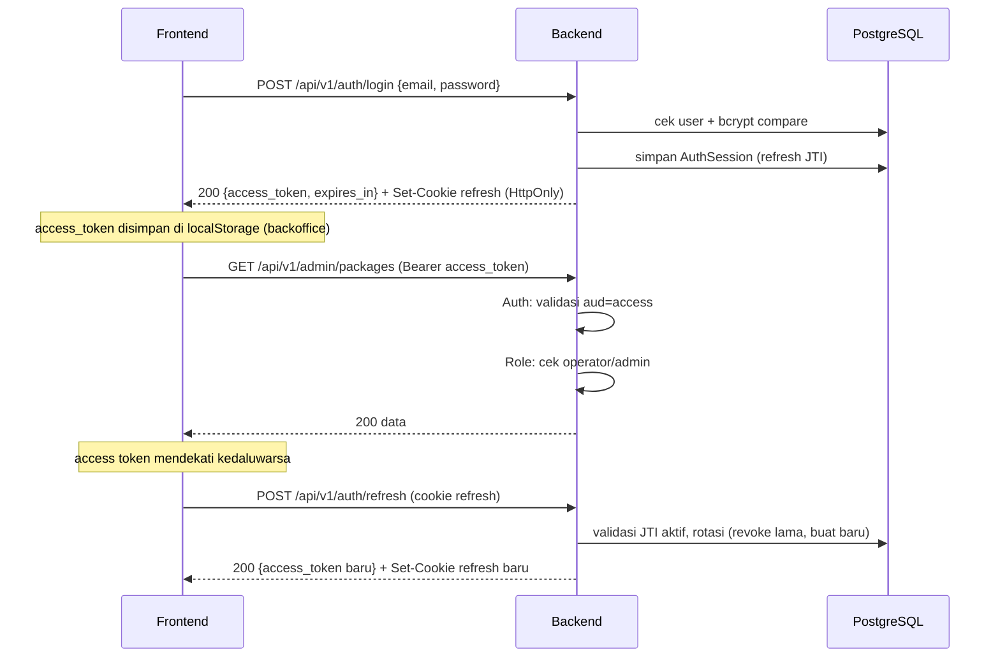

# API Reference

Dokumentasi seluruh endpoint HTTP backend Vero Travel Agents. Backend memakai Gin dan mengembalikan envelope respons seragam untuk semua endpoint.

- Base URL (dev): `http://localhost:8080`
- Definisi rute: [backend/internal/routes/routes.go](../../backend/internal/routes/routes.go)
- Handler: [backend/internal/handlers/handlers.go](../../backend/internal/handlers/handlers.go)
- OpenAPI 3.1: [backend/internal/handlers/docs.go](../../backend/internal/handlers/docs.go) (live di `/openapi.json`, UI di `/docs`)

## Envelope Respons

Semua endpoint mengembalikan struktur yang sama (lihat [backend/internal/utils/response.go](../../backend/internal/utils/response.go)):

```json
{
  "success": true,
  "message": "Human readable message",
  "data": {},
  "error": {}
}
```

- `success`: boolean status.
- `message`: pesan singkat untuk UI/log.
- `data`: payload sukses (omit saat error).
- `error`: detail error (omit saat sukses).

Frontend mem-parse envelope ini dan melempar `Error(message)` bila `success=false` atau status non-2xx (lihat `apiFetch` di kedua frontend).

## Middleware Global

Diterapkan ke semua request via `router.Use(...)` di [backend/cmd/server/main.go](../../backend/cmd/server/main.go):

| Middleware | Fungsi | Sumber |
|---|---|---|
| `RequestID` | Set/teruskan `X-Request-ID` per request | [middlewares.go](../../backend/internal/middlewares/middlewares.go) |
| `SecureHeaders` | `X-Content-Type-Options`, `X-Frame-Options`, dll | sda |
| `CORS` | Izinkan origin `localhost:3000/3001/5173`, `AllowCredentials=true` | sda |
| `RateLimit` | 20 req/detik global (token bucket) | sda |
| `gin.Logger` | Log akses | gin |
| `Recovery` | Tangani panic -> 500 envelope | sda |

## Middleware Per-Rute

- `Auth(jwt)` — wajib `Authorization: Bearer <access_token>`. Memvalidasi audience `access`. Jika refresh token dipakai sebagai access, dicatat sebagai event audit `refresh_token_used_as_access`. Set `user_id`, `role`, `email` ke context.
- `Role(roles...)` — RBAC; harus dijalankan SETELAH `Auth`. Membandingkan `role` di context dengan daftar role yang diizinkan.

## Authentication & Authorization Flow



Poin penting:
- Dua token dipisah by **audience claim**: `access` (TTL default 15 menit) dan `refresh` (TTL default 720 jam).
- Refresh token disimpan sebagai `AuthSession` di DB (punya `TokenJTI`), dikirim sebagai **cookie HttpOnly** di path `/api/v1/auth`. Tidak pernah masuk ke JS.
- Setiap refresh **merotasi** session (revoke lama, terbitkan baru).
- **Reuse detection**: jika refresh token yang sudah dirotasi dipakai lagi (indikasi pencurian), SEMUA sesi user dicabut + log `refresh_token_reuse_detected`. Lihat `AuthService.Refresh()` di [services.go](../../backend/internal/services/services.go).
- Guest chat membuat user "Guest Traveler" otomatis tanpa login.
- Implementasi JWT: [backend/internal/auth/jwt.go](../../backend/internal/auth/jwt.go); cookie: [backend/internal/auth/cookie.go](../../backend/internal/auth/cookie.go); audit: [backend/internal/auth/audit.go](../../backend/internal/auth/audit.go).

## Daftar Endpoint

Legenda: 🔓 publik · 🔒 butuh access token · 👮 butuh role operator/admin.

### Health & Docs

| Method | Path | Akses | Fungsi |
|---|---|---|---|
| GET | `/health` | 🔓 | Status service + uptime |
| GET | `/health/database` | 🔓 | Cek koneksi DB (timeout 3s) |
| GET | `/openapi.json` | 🔓 | Spec OpenAPI 3.1 |
| GET | `/docs` | 🔓 | Scalar API reference UI |

### Auth (`/api/v1/auth`)

| Method | Path | Akses | Fungsi |
|---|---|---|---|
| POST | `/register` | 🔓 | Daftar user; set cookie refresh; balas access token |
| POST | `/login` | 🔓 | Login email/username + password |
| POST | `/refresh` | 🔓 (cookie) | Rotasi refresh -> access token baru |
| POST | `/logout` | 🔓 (cookie) | Revoke session + hapus cookie |
| GET | `/me` | 🔒 | Profil user saat ini |

Request penting:
- `register`: `{name, email, password(min 8), role?}` (DTO `RegisterRequest`).
- `login`: `{email|username, password}` (DTO `LoginRequest`).
- `refresh`/`logout`: tanpa body; refresh token dibaca dari cookie HttpOnly.
- Response auth: `{access_token, token_type:"Bearer", expires_in, user}` (user di-omit pada refresh).

### Chat & AI

| Method | Path | Akses | Fungsi |
|---|---|---|---|
| POST | `/api/v1/chat` | 🔓 guest | Jalankan workflow AI; balas message + recommended_packages |
| GET | `/api/v1/chat/sessions` | 🔒 | Daftar sesi chat milik user |
| GET | `/api/v1/chat/:id/messages` | 🔒 | Pesan dalam satu sesi |
| GET | `/api/v1/events/stream` | 🔒 | SSE stream event workflow/payment/log |

- `chat` request: `{prompt(min 2), session_id?, stream?}` (DTO `ChatRequest`).
- `chat` response data: `{session_id, message, workflow[], recommended_packages[]}` (lihat `ChatResult`).

### Packages (publik) & Trips (terproteksi)

| Method | Path | Akses | Fungsi |
|---|---|---|---|
| GET | `/api/v1/packages` | 🔓 | Daftar paket published (untuk customer FE) |
| GET | `/api/v1/packages/:id` | 🔓 | Detail paket published (by id atau slug) |
| GET | `/api/v1/trips` | 🔒 | Daftar trip (mendukung filter query) |
| GET | `/api/v1/trips/:id` | 🔒 | Detail trip by id |
| POST | `/api/v1/trips` | 👮 | Buat trip |
| PUT | `/api/v1/trips/:id` | 👮 | Update trip |
| DELETE | `/api/v1/trips/:id` | 👮 | Hapus trip |

Query `TripListQuery`: `category`, `status`, `search`, `published_only`, `limit`, `offset`.

### Admin (`/api/v1/admin`, semua 👮) — dipakai backoffice

| Method | Path | Fungsi |
|---|---|---|
| GET | `/packages` | List paket (filter `category`, `search`) |
| POST | `/packages` | Buat paket |
| PUT | `/packages/:id` | Update paket / ubah status |
| DELETE | `/packages/:id` | Hapus paket |
| POST | `/uploads` | Upload media gambar (FormData `file`, maks per file; ext jpg/jpeg/png/webp/gif) |
| GET | `/dashboard` | Analytics dashboard |

`admin/packages` dan `trips` memetakan ke handler yang sama (`ListTrips`/`CreateTrip`/`UpdateTrip`/`DeleteTrip`). Beda utama: grup `/admin` memaksa role operator/admin untuk semua verb termasuk GET.

### Bookings & Payments

| Method | Path | Akses | Fungsi |
|---|---|---|---|
| POST | `/api/v1/bookings` | 🔒 | Buat booking (status pending/waiting_payment) |
| GET | `/api/v1/bookings` | 👮 | Daftar semua booking (pagination `limit`/`offset`) |
| GET | `/api/v1/bookings/:id` | 🔒 | Detail booking |
| POST | `/api/v1/payments/create` | 🔒 | Buat payment intent (QRIS/VA) |
| GET | `/api/v1/payments/:id` | 🔒 | Detail payment |
| POST | `/api/v1/payments/webhook` | 🔓 | Webhook DOKU (verifikasi HMAC-SHA256) |

- `booking` request: `{trip_id, total_price}` (DTO `BookingRequest`).
- `payment create` request: `{booking_id, payment_method(oneof QRIS|VA|VIRTUAL_ACCOUNT), amount}` (DTO `PaymentCreateRequest`).
- `webhook` request: `{external_id, status, signature?}`. Signature juga bisa via header `X-Doku-Signature`. Verifikasi: `HMAC-SHA256(external_id + status, DOKU_SECRET)`.
- Saat status `paid`/`settlement`: publish event `booking_confirmed` + trigger webhook N8N.

### Logs & Analytics (semua 👮)

| Method | Path | Fungsi |
|---|---|---|
| GET | `/api/v1/logs` | Daftar AILog (pagination `limit`/`offset`) |
| GET | `/api/v1/logs/workflows` | Alias ke logs (workflow) |
| GET | `/api/v1/logs/tool-calls` | Daftar ToolCall MCP (pagination `limit`/`offset`) |
| GET | `/api/v1/analytics/dashboard` | Statistik agregat (lihat `AnalyticsService.Dashboard`) |

Query `ListQuery` (bookings, logs, tool-calls): `limit` (default 50, maks 200), `offset` (default 0). Dipakai untuk pagination sederhana.

## Server-Sent Events (SSE)

Endpoint `GET /api/v1/events/stream` (🔒) menstream event dari event bus in-memory. Handler: `EventStream` di [handlers.go](../../backend/internal/handlers/handlers.go), bus: [backend/internal/events/bus.go](../../backend/internal/events/bus.go).

Event yang dipublikasikan:
- Workflow chat: `ai_thinking`, `searching_destination`, `calculating_budget`, `generating_itinerary`, `ai_response`, `workflow_completed`
- Tool & data: `mcp_tool_executed`, `trip_created`, `booking_created`
- Payment: `payment_created`, `payment_updated`, `booking_confirmed`
- Keep-alive: `heartbeat` (tiap 25 detik)

Catatan: `create_payment` MCP tool dinonaktifkan, jadi `payment_created`/`booking_confirmed` hanya berasal dari API booking/payment, bukan workflow chat.

> Penting: SSE membuat `WriteTimeout` server diset `0` (lihat main.go), agar koneksi long-lived tidak terputus.
