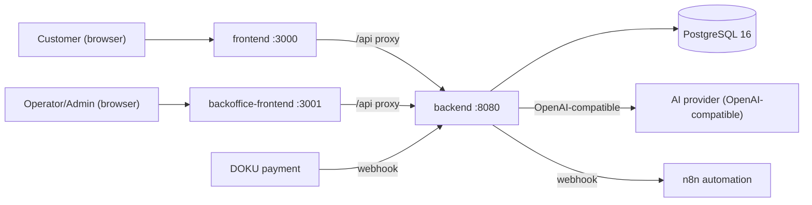
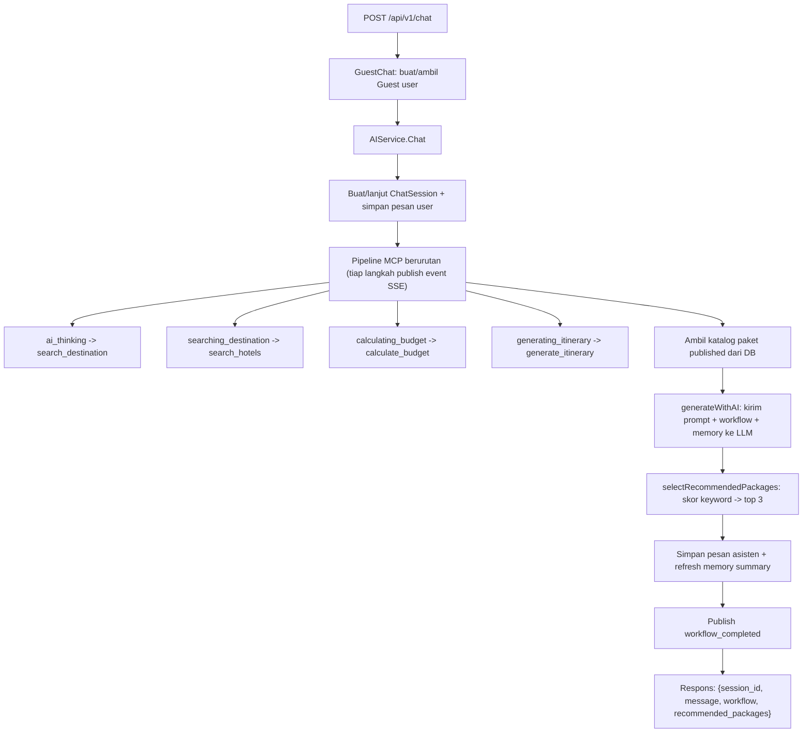
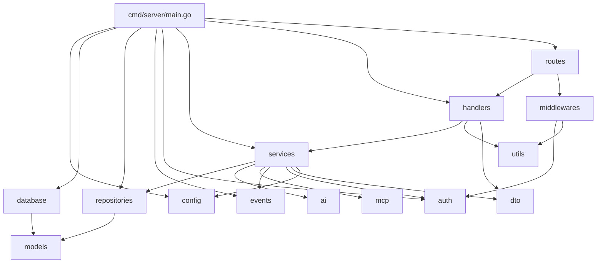

# Architecture

Dokumen ini menjelaskan arsitektur sistem VeroAiTravelAgents secara menyeluruh: bagaimana komponen tersusun, bagaimana data mengalir, pola desain yang dipakai, dan keputusan arsitektur penting. Tujuannya agar agent AI berikutnya paham "bentuk" sistem tanpa membaca seluruh repo.

## 1. Gambaran Sistem

VeroAiTravelAgents adalah **monorepo** berisi tiga aplikasi independen yang di-deploy terpisah:

| Aplikasi | Stack | Peran | Port dev |
|---|---|---|---|
| `backend/` | Go 1.25.5, Gin, GORM, PostgreSQL 16 | Orkestrator inti: REST API, chat AI, booking, payment, SSE | `8080` |
| `frontend/` | Next.js 14 (App Router), React 18, TS, Tailwind | UI chat AI untuk pelanggan/tamu | `3000` |
| `backoffice-frontend/` | Next.js 14, React 18, TS, Tailwind | Dashboard operator/admin kelola paket trip | `3000` (jalankan di `3001` agar tidak bentrok) |

Tidak ada workspace manager pemersatu (tidak ada root `package.json`/`go.work`). Setiap aplikasi berdiri sendiri. Komunikasi terjadi lewat HTTP: kedua frontend memanggil backend.



## 2. Arsitektur Backend (Clean/Layered)

Backend memakai layered architecture dengan dependency injection manual. Aliran request:

```
HTTP request
  -> middlewares (RequestID, SecureHeaders, CORS, RateLimit, Logger, Recovery)
  -> routes (registrasi + Auth/Role middleware per-grup)
  -> handlers (parse/validasi DTO, panggil service, bungkus respons)
  -> services (logika bisnis)
  -> repositories (akses data)
  -> GORM -> PostgreSQL
```

Lapisan dan tanggung jawabnya:

- **`cmd/server/main.go`** — entry point. Memuat config, validasi, connect DB, AutoMigrate, wiring semua dependency, daftarkan rute, jalankan HTTP server dengan graceful shutdown.
- **`internal/config`** — memuat env ke struct `Config` + `Validate()`.
- **`internal/database`** — koneksi GORM (retry 5x, pooling), `AutoMigrate`, migrasi legacy, health check.
- **`internal/models`** — skema GORM (entity).
- **`internal/repositories`** — akses data (CRUD). Satu-satunya lapisan yang menyentuh GORM langsung (kecuali Analytics yang query agregat lewat `repo.DB`).
- **`internal/services`** — logika bisnis, dipecah per-domain dalam satu package (`auth_service.go`, `ai_service.go`, `mcp_service.go`, `trip_service.go`, `booking_service.go`, `payment_service.go`, `log_service.go`, `analytics_service.go`, `helpers.go`); `services.go` menyisakan wiring `New()` + tipe bersama.
- **`internal/handlers`** — HTTP handler + dokumentasi OpenAPI (`docs.go`).
- **`internal/routes`** — registrasi rute dan penerapan middleware per-grup.
- **`internal/middlewares`** — cross-cutting concerns.
- **`internal/auth`** — JWTService, cookie refresh, audit log keamanan.
- **`internal/ai`** — klien HTTP ke provider AI OpenAI-compatible + fallback lokal.
- **`internal/mcp`** — katalog definisi tool MCP.
- **`internal/events`** — event bus in-memory untuk SSE.
- **`internal/dto`** — request/response struct + aturan validasi binding.
- **`internal/utils`** — envelope respons API standar.

Detail per-module: lihat [modules.md](modules.md). Detail service: lihat [backend.md](backend.md).

## 3. Alur Data Utama

### 3.1 Chat AI (fitur inti, guest tanpa login)

`POST /api/v1/chat` -> `GuestChat` handler -> `AIService.Chat()`:



Catatan penting: tool `create_payment` **sengaja dinonaktifkan** di pipeline ini (lihat bagian Keputusan Arsitektur). Tool MCP saat ini **mock** (mengembalikan data dummy).

### 3.2 Auth (access + refresh token)

Lihat [api.md](api.md) bagian Authentication Flow untuk diagram lengkap. Ringkas:
- Login/Register menerbitkan access token (audience `access`, TTL 15 menit) + refresh token (audience `refresh`, TTL 720 jam) yang disimpan sebagai `AuthSession` di DB dan dikirim sebagai cookie HttpOnly path `/api/v1/auth`.
- Refresh dirotasi: setiap refresh mencabut session lama dan menerbitkan yang baru.
- Reuse detection: jika refresh token yang sudah dirotasi dipakai lagi (indikasi pencurian), SEMUA sesi user dicabut.

### 3.3 Pembayaran (booking -> payment -> webhook)

```
POST /api/v1/orders          -> Booking/Order (booking_status=pending, payment_status=pending_admin_processing)
GET  /api/v1/bookings        -> Order appears in Backoffice for admin processing

Temporary disabled behind PAYMENTS_ENABLED=false:
POST /api/v1/payments/create -> 503, preserved Payment code not executed
POST /api/v1/payments/webhook -> 503, DOKU webhook not processed

Future re-enable path:
POST /api/v1/payments/create -> Payment (ExternalID=DOKU-..., expired 15 menit)
POST /api/v1/payments/webhook (dari DOKU) -> verifikasi HMAC-SHA256 (message = external_id + status)
  jika status paid/settlement -> publish booking_confirmed + trigger webhook N8N (payment_success)
```

### 3.4 Realtime (SSE)

`GET /api/v1/events/stream` (perlu auth) men-subscribe ke `events.Bus` in-memory dan men-stream event ke client. Heartbeat tiap 25 detik. Karena SSE butuh koneksi hidup lama, `http.Server.WriteTimeout` di-set `0` (`main.go`).

Catatan: frontend customer saat ini TIDAK memakai SSE; efek "mengetik" di chat adalah animasi client-side. Stream SSE tersedia untuk konsumen operator/admin di masa depan.

## 4. Dependency Antar Module (Backend)



Aturan ketergantungan (penting, lihat [coding-rules.md](coding-rules.md)):
- Handler tidak mengakses repository langsung; selalu lewat service.
- Repository tidak tahu soal HTTP; hanya GORM + models.
- Models tidak mengimpor lapisan lain.

## 5. Design Pattern yang Digunakan

- **Layered architecture** — pemisahan handler/service/repository.
- **Dependency injection manual** — `services.New(...)` dan `handlers.New(...)` merangkai dependency di `main.go`; tidak ada framework DI.
- **Repository pattern** — semua akses data dibungkus method `repositories.Repository`.
- **Response envelope** — semua respons memakai `utils.APIResponse` `{success, message, data, error}`.
- **Publish/subscribe (event bus)** — `events.Bus` channel-based, non-blocking publish (drop jika channel penuh).
- **Adapter** — `internal/ai` membungkus provider LLM OpenAI-compatible dengan fallback lokal.
- **DTO + binding validation** — `internal/dto` memvalidasi input via tag `binding`.
- **Token rotation + audience separation** — JWT access vs refresh dipisah by audience claim.

Pola frontend (kedua app): **custom hook untuk data/logic** (`use-trip-form.ts`, `use-trips-list.ts`), **single API client** (`lib/api.ts`) dengan envelope-aware fetch, **proxy rewrite** `/api/*` ke backend, dan **dependency npm minimal** (`clsx`, `lucide-react`, `tailwind-merge` + Next/React — tanpa library animasi eksternal).

## 6. Keputusan Arsitektur Penting

1. **`create_payment` MCP dinonaktifkan di workflow chat.** Agar AI tidak pernah menyebut QRIS/pembayaran saat DOKU disabled. Ditandai `Enabled: false` di `internal/mcp/tools.go`, diblok di `MCPService.Execute()`, dan dikomentari di `internal/services/ai_service.go` (langkah workflow `Chat()`). Jangan aktifkan kembali tanpa `PAYMENTS_ENABLED=true` dan wiring booking+payment end-to-end.
2. **Tool MCP masih mock.** `internal/services/mcp_service.go` fungsi `mock()` mengembalikan data dummy. Integrasi LLM nyata sudah ada (`internal/ai`) dengan fallback lokal bila `AI_API_KEY` kosong.
3. **Guest chat tanpa auth.** `POST /api/v1/chat` membuat user "Guest Traveler" otomatis. Memudahkan demo; tidak butuh login.
4. **Refresh token sebagai session DB + cookie HttpOnly.** Bukan disimpan di JS. Bisa di-revoke, dirotasi tiap refresh, dengan reuse detection revoke-all.
5. **Access TTL pendek (15 menit).** Memperkecil dampak XSS; refresh otomatis menangani perpanjangan.
6. **`WriteTimeout=0`** demi SSE long-lived.
7. **Service dipecah per-domain** dalam package `services` (refactor 25 Jun 2026); `services.go` hanya berisi wiring + tipe bersama.
8. **Envelope respons seragam** dipakai konsisten; frontend bergantung pada `payload.data`.

## 7. Entry Point Aplikasi

| Aplikasi | Entry point | Cara jalan |
|---|---|---|
| Backend | `backend/cmd/server/main.go` | `go run ./cmd/server` atau `docker compose up --build` |
| Frontend | `frontend/src/app/page.tsx` (+ `layout.tsx`) | `npm run dev` |
| Backoffice | `backoffice-frontend/src/app/page.tsx` (+ `layout.tsx`, gerbang auth `components/app-shell.tsx`) | `npm run dev -- --port 3001` |

Untuk peta navigasi lengkap, lihat [project-map.md](project-map.md).
