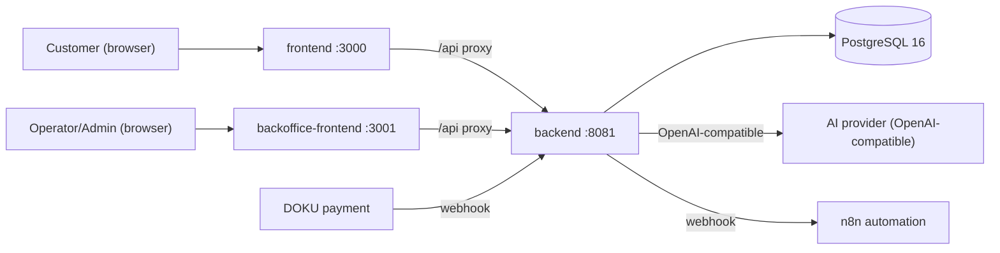
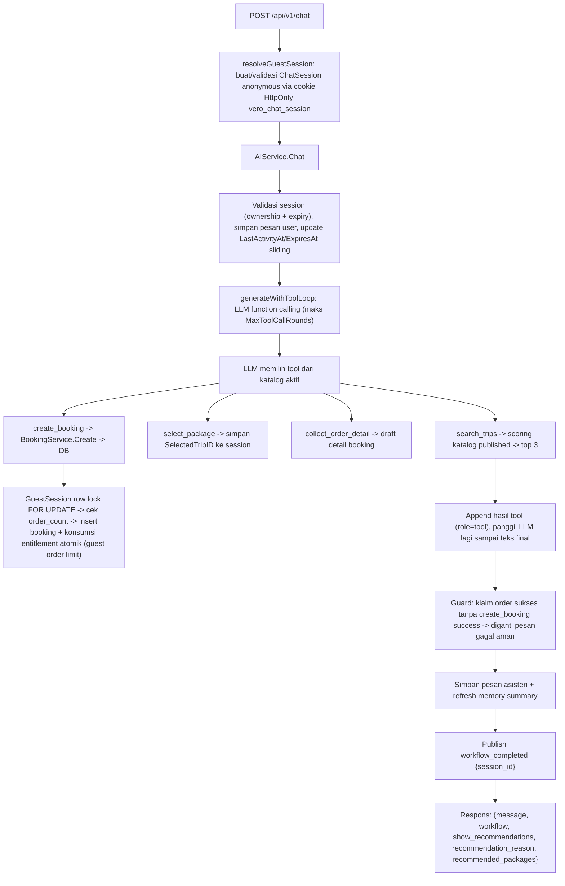
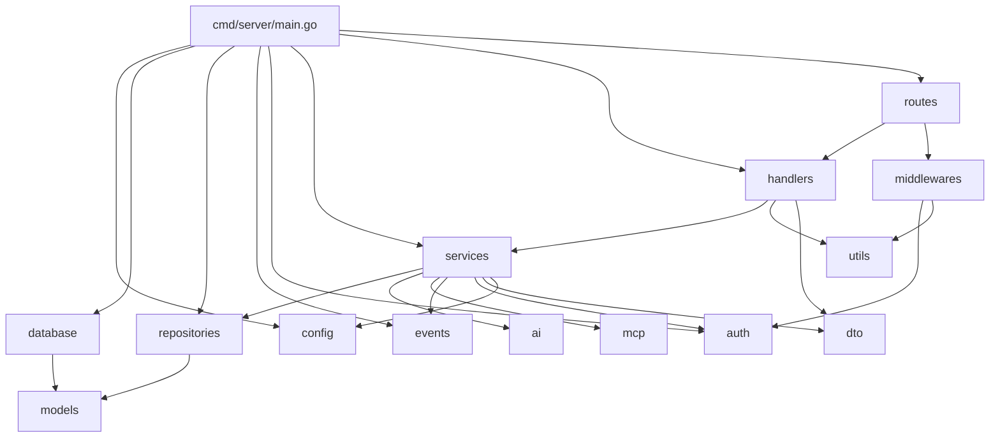

# Architecture

Dokumen ini menjelaskan arsitektur sistem VeroAiTravelAgents secara menyeluruh: bagaimana komponen tersusun, bagaimana data mengalir, pola desain yang dipakai, dan keputusan arsitektur penting. Tujuannya agar agent AI berikutnya paham "bentuk" sistem tanpa membaca seluruh repo.

## 1. Gambaran Sistem

VeroAiTravelAgents adalah **monorepo** berisi tiga aplikasi independen yang di-deploy terpisah:

| Aplikasi | Stack | Peran | Port dev |
|---|---|---|---|
| `backend/` | Go 1.25.5, Gin, GORM, PostgreSQL 16 | Orkestrator inti: REST API, chat AI, booking, payment, SSE | `8081` |
| `frontend/` | Next.js 14 (App Router), React 18, TS, Tailwind | UI chat AI untuk pelanggan/tamu | `3000` |
| `backoffice-frontend/` | Next.js 14, React 18, TS, Tailwind | Dashboard operator/admin kelola paket trip | `3000` (jalankan di `3001` agar tidak bentrok) |

Tidak ada workspace manager pemersatu (tidak ada root `package.json`/`go.work`). Setiap aplikasi berdiri sendiri. Komunikasi terjadi lewat HTTP: kedua frontend memanggil backend.


```mermaid
flowchart LR
  Customer["Customer (browser)"] --> FE["frontend :3000"]
  Operator["Operator/Admin (browser)"] --> BO["backoffice-frontend :3001"]
  FE -->|"/api proxy"| BE["backend :8081"]
  BO -->|"/api proxy"| BE
  BE --> PG[("PostgreSQL 16")]
  BE -->|"OpenAI-compatible"| AI["AI provider (OpenAI-compatible)"]
  BE -->|"webhook"| N8N["n8n automation"]
  DOKU["DOKU payment"] -->|"webhook"| BE
```

## 2. Arsitektur Backend (Clean/Layered)

Backend memakai layered architecture dengan dependency injection manual. Aliran request:

```
HTTP request
  -> middlewares (RequestID, SecureHeaders, CORS, RateLimit, Logger, Recovery)
  -> routes (registrasi + Auth/Role middleware per-grup)
  -> handlers (parse/validasi DTO, panggil service, bungkus respons)
  -> services (logika bisnis)
  -> repositories (akses data)
  -> GORM -> PostgreSQL
```

Lapisan dan tanggung jawabnya:

- **`cmd/server/main.go`** — entry point. Memuat config, validasi, connect DB, AutoMigrate, wiring semua dependency, daftarkan rute, jalankan HTTP server dengan graceful shutdown.
- **`internal/config`** — memuat env ke struct `Config` + `Validate()`.
- **`internal/database`** — koneksi GORM (retry 5x, pooling), `AutoMigrate`, migrasi legacy, health check.
- **`internal/models`** — skema GORM (entity).
- **`internal/repositories`** — akses data (CRUD). Satu-satunya lapisan yang menyentuh GORM langsung. Sejak SEC-27 (1 Agu 2026): kontrak tiap domain dinyatakan sebagai interface di `repositories/interfaces.go` (`UserRepository`, ..., `AnalyticsRepository`); query agregat analytics pindah ke method repo (`analytics_repository.go`) sehingga tidak ada lagi akses `repo.DB` mentah dari service.

- **`internal/services`** — logika bisnis, dipecah per-domain dalam satu package (`auth_service.go`, `ai_service.go`, `mcp_service.go`, `trip_service.go`, `booking_service.go`, `payment_service.go`, `log_service.go`, `analytics_service.go`, `helpers.go`); `services.go` menyisakan wiring `New()` + tipe bersama.
- **`internal/handlers`** — HTTP handler, dipecah per-domain dalam satu package (`auth_handlers.go`, `chat_handlers.go`, `trip_handlers.go`, `booking_handlers.go`, `payment_handlers.go`, `logs_handlers.go`, `upload_handlers.go`, `sse_handlers.go`, `health_handlers.go`); `handlers.go` hanya berisi `Handler` struct + `New()`, `helpers.go` helper bersama, `docs.go` dokumentasi OpenAPI.
- **`internal/routes`** — registrasi rute dan penerapan middleware per-grup.
- **`internal/middlewares`** — cross-cutting concerns.
- **`internal/auth`** — JWTService, cookie refresh, audit log keamanan.
- **`internal/ai`** — klien HTTP ke provider AI OpenAI-compatible + fallback lokal.
- **`internal/mcp`** — katalog definisi tool MCP.
- **`internal/events`** — event bus in-memory untuk SSE.
- **`internal/dto`** — request/response struct + aturan validasi binding.
- **`internal/utils`** — envelope respons API standar.

Detail per-module: lihat [modules.md](modules.md). Detail service: lihat [backend.md](backend.md).

## 3. Alur Data Utama

### 3.1 Chat AI (fitur inti, guest tanpa login)

`POST /api/v1/chat` -> `GuestChat` handler -> `AIService.Chat()`:


```mermaid
flowchart TD
  A["POST /api/v1/chat"] --> B["resolveGuestSession: buat/validasi ChatSession anonymous via cookie HttpOnly vero_chat_session"]
  B --> C["AIService.Chat"]
  C --> D["Validasi session (ownership + expiry), simpan pesan user, update LastActivityAt/ExpiresAt sliding"]
  D --> E["generateWithToolLoop: LLM function calling (maks MaxToolCallRounds)"]
  E --> E1["LLM memilih tool dari katalog aktif"]
  E1 --> E2["search_trips -> scoring katalog published -> top 3"]
  E1 --> E3["select_package -> simpan SelectedTripID ke session"]
  E1 --> E4["collect_order_detail -> draft detail booking"]
  E1 --> E5["create_booking -> BookingService.Create -> DB"]
   E5 --> E5a["GuestSession row lock FOR UPDATE -> cek order_count -> insert booking + konsumsi entitlement atomik (guest order limit)"]
  E2 --> F["Append hasil tool (role=tool), panggil LLM lagi sampai teks final"]
  F --> G["Guard: klaim order sukses tanpa create_booking success -> diganti pesan gagal aman"]
  G --> H["Simpan pesan asisten + refresh memory summary"]
  H --> I["Publish workflow_completed {session_id}"]
  I --> J["Respons: {message, workflow, show_recommendations, recommendation_reason, recommended_packages}"]
```

Catatan penting:
- Rekomendasi paket **hanya** berasal dari tool `search_trips` (tidak ada lagi scoring otomatis pasca-LLM). Detail alur: lihat [backend.md](backend.md) bagian AIService.
- Session identifier tidak dikembalikan di JSON; ownership proof = cookie HttpOnly `vero_chat_session` (sliding TTL default 7 hari). `GuestChatSession` ber-`UserID=NULL` (anonymous), bukan lagi user bersama `guest@vero.local`.
- Tool `create_payment` **sengaja dinonaktifkan** (lihat bagian Keputusan Arsitektur). Tool lama `search_destination`, `search_hotels`, `calculate_budget`, `generate_itinerary`, `update_order_draft` dinonaktifkan dari katalog OpenAI; `MCPService.Execute()` memetakan nama lama ke `search_trips` untuk kompatibilitas logging.
- Pipeline lama yang berurutan (ai_thinking -> search_destination -> ... -> generate_itinerary) **sudah tidak dipakai**; workflow kini digerakkan LLM via function calling loop.

### 3.2 Auth (access + refresh token)

Lihat [api.md](api.md) bagian Authentication Flow untuk diagram lengkap. Ringkas:
- Login/Register menerbitkan access token (audience `access`, TTL 15 menit) + refresh token (audience `refresh`, TTL 720 jam) yang disimpan sebagai `AuthSession` di DB dan dikirim sebagai cookie HttpOnly path `/api/v1/auth`.
- Refresh dirotasi atomik: setiap refresh mencabut session lama dan menerbitkan yang baru dalam satu UPDATE bersyarat (`RotateSession`, fix BUG-1); concurrent refresh tidak menghasilkan sesi ganda.
- Reuse detection: jika refresh token yang sudah dirotasi dipakai lagi >1 menit setelah rotasi (indikasi pencurian), SEMUA sesi user dicabut; reuse dalam window 1 menit dianggap race sah (tidak revoke-all).

### 3.3 Pembayaran (booking -> payment -> webhook)

```
POST /api/v1/orders          -> Booking/Order (booking_status=pending, payment_status=pending_admin_processing)
GET  /api/v1/bookings        -> Order appears in Backoffice for admin processing

Temporary disabled behind PAYMENTS_ENABLED=false:
POST /api/v1/payments/create -> 503, preserved Payment code not executed
POST /api/v1/payments/webhook -> 503, DOKU webhook not processed

Future re-enable path:
POST /api/v1/payments/create -> Payment (ExternalID=DOKU-..., expired 15 menit)
POST /api/v1/payments/webhook (dari DOKU) -> verifikasi HMAC-SHA256 (message = external_id + status)
  jika status paid/settlement -> publish booking_confirmed + trigger webhook N8N (payment_success)
```

### 3.4 Realtime (SSE)

`GET /api/v1/events/stream` (perlu auth, role operator/admin — SEC-18) men-subscribe ke `events.Bus` in-memory dan men-stream event ke client. Heartbeat tiap 25 detik via `time.NewTicker`. Karena SSE butuh koneksi hidup lama, `http.Server.WriteTimeout` di-set `15 * time.Second` (`main.go`) dan dinonaktifkan secara dinamis di handler.

Karena didukung dynamic override di handler SSE, koneksi zombie dijaga oleh tiga guard di `EventStream` (BUG-4): (1) write-error detection per-tulis via `http.NewResponseController` + `SetWriteDeadline(10s)` + `Flush()`; (2) max lifetime `sseMaxLifetime=30 menit` — server mengirim event `reconnect` lalu menutup; `EventSource` browser reconnect otomatis; (3) cap subscriber `events.MaxSubscribers=100` — request baru membalas 503 bila penuh. Tanpa guard ini, koneksi setengah-putus (NAT timeout/laptop sleep) tidak terdeteksi cepat → goroutine + subscriber bus bocor. Detail: lihat [backend.md](backend.md) Mekanisme Realtime dan [api.md](api.md) SSE.

Catatan: frontend customer saat ini TIDAK memakai SSE event-bus (`/events/stream`); efek "mengetik" di chat adalah animasi client-side. **PERF-1 (3 Agu 2026):** namun, respons chat AI kini di-stream langsung dari handler chat (`POST /api/v1/chat` dengan `stream:true`) sebagai SSE per-request — ini terpisah dari `/events/stream` (event bus broadcast). Final text round LLM di-stream token-by-token (`ai.Client.GenerateStream` → `AIService.ChatStream` → `streamChat` handler) untuk menurunkan TTFT; tool-selection rounds tetap non-streaming. Frontend customer memakai `fetch` + `ReadableStream` reader (`streamChat` di `lib/api.ts`), bukan `EventSource`, karena `POST` tidak didukung `EventSource` native. Stream SSE event-bus tetap tersedia untuk konsumen operator/admin di masa depan.

## 4. Dependency Antar Module (Backend)


```mermaid
flowchart TD
  main["cmd/server/main.go"] --> config
  main --> database
  main --> repositories
  main --> events
  main --> auth
  main --> services
  main --> handlers
  main --> routes
  routes --> handlers
  routes --> middlewares
  handlers --> services
  handlers --> utils
  handlers --> dto
  services --> repositories
  services --> ai
  services --> mcp
  services --> events
  services --> auth
  services --> dto
  services --> config
  repositories --> models
  database --> models
  middlewares --> auth
  middlewares --> utils
```

Aturan ketergantungan (penting, lihat [coding-rules.md](coding-rules.md)):
- Handler tidak mengakses repository langsung; selalu lewat service.
- Repository tidak tahu soal HTTP; hanya GORM + models.
- Models tidak mengimpor lapisan lain.

## 5. Design Pattern yang Digunakan

- **Layered architecture** — pemisahan handler/service/repository.
- **Dependency injection manual** — `services.New(...)` dan `handlers.New(...)` merangkai dependency di `main.go`; tidak ada framework DI.
- **Repository pattern** — semua akses data dibungkus method `repositories.Repository`; sejak SEC-27 kontrak dinyatakan sebagai interface per-domain (`repositories/interfaces.go`) agar service dapat di-mock.

- **Response envelope** — semua respons memakai `utils.APIResponse` `{success, message, data, error}`.
- **Publish/subscribe (event bus)** — `events.Bus` channel-based, non-blocking publish (drop jika channel penuh).
- **Adapter** — `internal/ai` membungkus provider LLM OpenAI-compatible dengan fallback lokal.
- **DTO + binding validation** — `internal/dto` memvalidasi input via tag `binding`.
- **Token rotation + audience separation** — JWT access vs refresh dipisah by audience claim.

Pola frontend (kedua app): **custom hook untuk data/logic** (`use-trip-form.ts`, `use-trips-list.ts`), **single API client** (`lib/api.ts`) dengan envelope-aware fetch, **proxy rewrite** `/api/*` ke backend, dan **dependency npm minimal** (`clsx`, `lucide-react`, `tailwind-merge` + Next/React — tanpa library animasi eksternal).

## 6. Keputusan Arsitektur Penting

1. **`create_payment` MCP dinonaktifkan di workflow chat.** Agar AI tidak pernah menyebut QRIS/pembayaran saat DOKU disabled. Ditandai `Enabled: false` di `internal/mcp/tools.go`, diblok di `MCPService.Execute()`, dan dikomentari di `internal/services/ai_service.go` (langkah workflow `Chat()`). Jangan aktifkan kembali tanpa `PAYMENTS_ENABLED=true` dan wiring booking+payment end-to-end.
2. **Tool MCP lama masih mock/legacy.** Tool rekomendasi lama (`search_destination`, `search_hotels`, `calculate_budget`, `generate_itinerary`) sudah dinonaktifkan dari katalog OpenAI; `MCPService.Execute()` memetakan nama-nama itu ke `search_trips` demi kompatibilitas. Fungsi `mock()` kini hanya menangani `send_whatsapp` (juga disabled) dan fallback `unknown tool`. Integrasi LLM nyata sudah ada (`internal/ai`) dengan fallback lokal bila `AI_API_KEY` kosong.
3. **Guest chat tanpa auth, session anonymous.** `POST /api/v1/chat` memakai `ChatSession` ber-`UserID=NULL` yang diikat cookie HttpOnly `vero_chat_session` (bukan lagi user bersama `guest@vero.local`). Identitas order-limit guest adalah `GuestSession` (cookie `vero_guest_session`, token opaque hash-only); booking guest memakai user guest terisolasi per session (`guest-<uuid>@vero.local`) untuk memenuhi kontrak `bookings.user_id NOT NULL`, plus `bookings.guest_session_id` sebagai otoritas ownership/limit.
4. **Refresh token sebagai session DB + cookie HttpOnly.** Bukan disimpan di JS. Bisa di-revoke, dirotasi tiap refresh, dengan reuse detection revoke-all.
5. **Access TTL pendek (15 menit).** Memperkecil dampak XSS; refresh otomatis menangani perpanjangan.
6. **`WriteTimeout=15s`** global di HTTP server. Karena didukung override dinamis di handler SSE, koneksi zombie dijaga oleh tiga guard di `EventStream` (BUG-4): write-error detection (`ResponseController` + `Flush`), max lifetime 30 menit, cap subscriber 100.
7. **Service dipecah per-domain** dalam package `services` (refactor 25 Jun 2026); `services.go` hanya berisi wiring + tipe bersama.
8. **Envelope respons seragam** dipakai konsisten; frontend bergantung pada `payload.data`.
9. **Handler dipecah per-domain** dalam package `handlers` (refactor ARCH-5, 31 Jul 2026); `handlers.go` hanya berisi `Handler` struct + `New()`. Nama method dan kontrak API tidak berubah.
10. **Dependency Inversion pada layer service (SEC-27, 1 Agu 2026).** Service tidak lagi depend pada concrete `*repositories.Repository` maupun concrete service lain; tiap service depend pada interface narrow (interface segregation) yang di-satisfy concrete secara implisit. Interface domain repo di `repositories/interfaces.go`; interface inter-service (`BookingCreator`, `GuestUserProvider`, `MCPToolExecutor`) di file service masing-masing. Escape hatch `AnalyticsService`→`repo.DB` ditutup — query agregat pindah ke `repositories/analytics_repository.go`. Wiring `services.New()` tidak berubah.


## 7. Entry Point Aplikasi

| Aplikasi | Entry point | Cara jalan |
|---|---|---|
| Backend | `backend/cmd/server/main.go` | `go run ./cmd/server` atau `docker compose up --build` |
| Frontend | `frontend/src/app/page.tsx` (+ `layout.tsx`) | `npm run dev` |
| Backoffice | `backoffice-frontend/src/app/page.tsx` (+ `layout.tsx`, gerbang auth `components/app-shell.tsx`) | `npm run dev -- --port 3001` |

Untuk peta navigasi lengkap, lihat [project-map.md](project-map.md).
