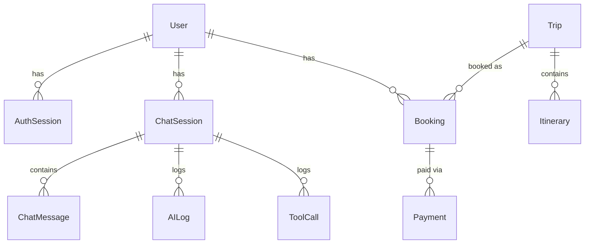

# Database

Dokumentasi struktur data, ORM, relasi, migrasi, dan lapisan repository untuk VeroAiTravelAgents.

- ORM: **GORM 1.31** (`gorm.io/gorm`) dengan driver PostgreSQL (`gorm.io/driver/postgres`)
- Database: **PostgreSQL 16**
- Definisi model: [backend/internal/models/models.go](../../backend/internal/models/models.go)
- Koneksi & migrasi: [backend/internal/database/database.go](../../backend/internal/database/database.go)
- Repository: [backend/internal/repositories/](../../backend/internal/repositories/)

## Koneksi & Pooling

Diatur di `database.Connect()` ([backend/internal/database/database.go](../../backend/internal/database/database.go)):

- **Retry koneksi 5x** dengan backoff bertambah (`attempt * 1 detik`). Berguna saat DB belum siap (mis. di docker-compose).
- **Connection pool**: `SetMaxOpenConns(25)`, `SetMaxIdleConns(10)`, `SetConnMaxLifetime(1 jam)`.
- **GORM logger**: `Info` saat `APP_ENV=development`, `Warn` selainnya.
- Health check via `Database.Health(ctx)` menggunakan `PingContext` dengan timeout (dipakai endpoint `GET /health/database`).

## Konvensi Umum Model

Semua entity menanam `BaseModel` ([models.go](../../backend/internal/models/models.go)):

```go
type BaseModel struct {
    ID        uuid.UUID      `gorm:"type:uuid;primaryKey"`
    CreatedAt time.Time
    UpdatedAt time.Time
    DeletedAt gorm.DeletedAt `gorm:"index"` // soft delete
}
```

Aturan penting (dokumentasikan sebagai pola wajib):
- **Primary key selalu UUID**, di-generate di hook `BeforeCreate` jika masih `uuid.Nil`. Jangan andalkan auto-increment.
- **Soft delete**: `DeletedAt` aktif di semua tabel. Query GORM standar otomatis menyaring baris terhapus. Jangan pakai hard delete kecuali sengaja.
- **Password tidak pernah diserialisasi** ke JSON (`json:"-"`). Pola ini wajib untuk field sensitif.
- Kolom uang pakai `numeric(14,2)`. Field array/objek (highlights, media, dll) disimpan sebagai **JSONB** via `serializer:json`.

## Entity Utama

### User ([models.go](../../backend/internal/models/models.go))
Akun pengguna. Punya `Role` (`user` | `operator` | `admin`).
- Relasi: `has many` ChatSession, Booking, AuthSession.
- Email `uniqueIndex`. Password bcrypt (tidak diserialisasi).
- Guest chat membuat user "Guest Traveler" (`guest@vero.local`) via `FirstOrCreateUser`.

### AuthSession ([models.go](../../backend/internal/models/models.go))
Menyimpan sesi refresh token untuk memungkinkan **revocation**.
- `TokenJTI` (`uniqueIndex`) = klaim `jti` dari refresh JWT.
- `ExpiresAt`, `RevokedAt` (nullable). Sesi dianggap aktif jika `RevokedAt IS NULL AND ExpiresAt > now`.
- Inti dari keamanan refresh token rotation + reuse detection (lihat [api.md](api.md) dan [backend.md](backend.md)).

### ChatSession & ChatMessage ([models.go](../../backend/internal/models/models.go))
Percakapan AI.
- `ChatSession` punya `Title` (ringkasan prompt pertama) dan `MemorySummary` (ringkasan memori jangka panjang, text).
- `ChatMessage` menyimpan `Role` (`user`/`assistant`) + `Content`. `has many` di bawah session (`foreignKey:SessionID`).

### Trip ([models.go](../../backend/internal/models/models.go))
Paket trip — entity paling kaya. Dipakai backoffice (CRUD) dan frontend (katalog publik + rekomendasi AI).
- `Slug` `uniqueIndex`. `Status` (`draft`/`published`/dll) dan `Category` ter-index.
- Field JSONB: `Media` (`[]TripMedia`), `Highlights`, `AmenitiesIncluded`, `AmenitiesExcluded`, `References` — semua `serializer:json;type:jsonb`.
- Harga: `BasePrice`, `EstimatedPrice`, `DiscountPrice`, `ChildPrice`, `ChildDiscount` (semua `numeric(14,2)`).
- `PublishedAt` di-set saat status berubah ke `published`.
- Relasi: `has many` Itinerary dengan **`constraint:OnDelete:CASCADE`** (hapus trip menghapus itinerary-nya).

### Itinerary ([models.go](../../backend/internal/models/models.go))
Rencana harian milik Trip. `Day`, `Title`, `Description`. Di-replace penuh saat update trip (lihat repository di bawah).

### Booking ([models.go](../../backend/internal/models/models.go))
Pemesanan trip oleh user.
- `BookingStatus` (default `pending`), `PaymentStatus` (default `waiting_payment`), `TotalPrice`, `BookingDate`.
- Relasi: `belongs to` User & Trip; `has many` Payment.

### Payment ([models.go](../../backend/internal/models/models.go))
Transaksi pembayaran untuk sebuah Booking.
- `PaymentMethod` (QRIS/VA), `ExternalID` (`DOKU-...`, ter-index), `Amount`, `Status`, `ExpiredAt` (15 menit dari pembuatan).
- Status `paid`/`settlement` memicu konfirmasi booking + webhook N8N.

### AILog & ToolCall ([models.go](../../backend/internal/models/models.go))
Observability untuk workflow AI.
- `AILog`: catatan tiap workflow/tool dengan `ExecutionTime` (ms), `Status`, `Response` (JSONB). `SessionID` nullable.
- `ToolCall`: detail pemanggilan tool MCP — `Payload`, `Result` (JSONB), `Status`.

## Diagram Relasi



## Migrasi

`Database.AutoMigrate()` ([database.go](../../backend/internal/database/database.go)) dipanggil di startup (`main.go`). Mendaftarkan 10 model secara berurutan: User, AuthSession, ChatSession, ChatMessage, Trip, Itinerary, Booking, Payment, AILog, ToolCall.

### Migrasi legacy: `slots` -> `adult_pax`
`migrateLegacySlots()` menangani skema lama: jika kolom `slots` masih ada di tabel `trips`, menyalin nilainya ke `adult_pax` untuk baris yang belum punya pax. Pola ini contoh **migrasi data idempoten** — selalu cek `Migrator().HasColumn` dulu.

> Catatan: proyek mengandalkan AutoMigrate, bukan file migrasi versioned. Perubahan skema yang destruktif (drop/rename kolom) TIDAK ditangani AutoMigrate dan butuh penanganan manual.

## Lapisan Repository

Semua akses DB lewat `repositories.Repository` ([backend/internal/repositories/repositories.go](../../backend/internal/repositories/repositories.go)). Service tidak pernah memanggil GORM langsung kecuali `AnalyticsService` (agregasi). Pola ini wajib diikuti.

File:
- [repositories.go](../../backend/internal/repositories/repositories.go) — CRUD untuk User, ChatSession/Message, Trip/Itinerary, Booking, Payment, AILog, ToolCall.
- [auth_sessions.go](../../backend/internal/repositories/auth_sessions.go) — operasi AuthSession (refresh token).

### Repository penting

| Method | Fungsi |
|---|---|
| `FirstOrCreateUser` | Idempotent create (dipakai guest chat) |
| `ListTrips(query)` | List trip dengan filter `category`, `status`, `search`, `published_only`, `limit`, `offset` |
| `ListBookings(query)` | List booking dengan pagination `Limit`/`Offset` + preload User, Trip, Payments |
| `RecentBookings(limit)` | Booking terbaru (tanpa preload Payments) untuk dashboard analytics — ringan |
| `ListAILogs(query)` | List AILog dengan pagination `Limit`/`Offset` |
| `ListToolCalls(query)` | List ToolCall dengan pagination `Limit`/`Offset` |
| `FindTripBySlugOrID` | Cari trip by slug atau UUID (dipakai endpoint paket publik) |
| `ReplaceTripItineraries` | **Hapus lalu buat ulang** semua itinerary trip dalam satu transaksi (pola replace-all, bukan upsert) |
| `ListRecentChatMessages(id, limit)` | N pesan terakhir untuk konteks AI |
| `TailChatMessages(id, limit)` | N pesan terakhir (oldest-first) untuk refresh memory summary — efisien untuk sesi panjang |
| `CreateAuthSession` | Simpan sesi refresh saat login/refresh |
| `FindActiveSessionByJTI` | Sesi yang belum revoked & belum expired |
| `RevokeSessionByJTI` | Revoke satu sesi (rotation saat refresh) |
| `RevokeAllActiveSessionsByUser` | **Revoke semua sesi user** saat reuse refresh token terdeteksi (proteksi pencurian token) |

### Pola transaksi
`ReplaceTripItineraries` memakai transaksi GORM untuk delete + insert. Operasi multi-langkah yang harus atomik mengikuti pola ini.

### Pagination (`dto.ListQuery`)

Endpoint list bookings, logs, dan tool-calls memakai `dto.ListQuery` (`Limit`, `Offset`) yang dinormalisasi via `Normalize()`:
- Default `Limit` = 50 (`DefaultListLimit`).
- Maksimum `Limit` = 200 (`MaxListLimit`) untuk mencegah memory berlebih.
- `Offset` negatif di-set ke 0.

Handler memanggil `c.ShouldBindQuery(&query)` lalu `query.Normalize()` sebelum meneruskan ke service/repo. `TripListQuery` punya `Limit`/`Offset` sendiri tapi belum memakai `Normalize()` (backward-compatible, limit 0 = tanpa batas).

## Catatan untuk Agent

- Untuk menambah field ke entity: edit `models.go`, AutoMigrate menangani penambahan kolom otomatis saat restart. Tambah field terkait di `dto` dan mapping di service jika perlu diekspos lewat API.
- Untuk query baru: tambahkan method di repository, jangan akses `r.DB` dari service.
- Perhatikan serialisasi JSON: field bertanda `json:"-"` (mis. Password, relasi balik) tidak akan muncul di response API.
- Lihat [api.md](api.md) untuk bagaimana entity dipetakan ke endpoint, dan [backend.md](backend.md) untuk logika bisnis yang memanipulasinya.
