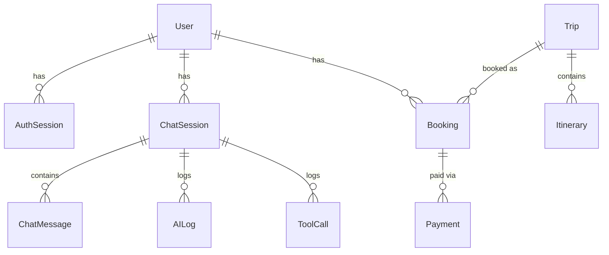

# Database

Dokumentasi struktur data, ORM, relasi, migrasi, dan lapisan repository untuk VeroAiTravelAgents.

- ORM: **GORM 1.31** (`gorm.io/gorm`) dengan driver PostgreSQL (`gorm.io/driver/postgres`)
- Database: **PostgreSQL 16**
- Definisi model: [backend/internal/models/models.go](../../backend/internal/models/models.go)
- Koneksi & migrasi: [backend/internal/database/database.go](../../backend/internal/database/database.go)
- Repository: [backend/internal/repositories/](../../backend/internal/repositories/)

## Koneksi & Pooling

Diatur di `database.Connect()` ([backend/internal/database/database.go](../../backend/internal/database/database.go)):

- **Retry koneksi 5x** dengan backoff bertambah (`attempt * 1 detik`). Berguna saat DB belum siap (mis. di docker-compose).
- **Connection pool**: `SetMaxOpenConns(25)`, `SetMaxIdleConns(10)`, `SetConnMaxLifetime(1 jam)`.
- **GORM logger**: `Info` saat `APP_ENV=development`, `Warn` selainnya.
- Health check via `Database.Health(ctx)` menggunakan `PingContext` dengan timeout (dipakai endpoint `GET /health/database`).

## Konvensi Umum Model

Semua entity menanam `BaseModel` ([models.go](../../backend/internal/models/models.go)):

```go
type BaseModel struct {
    ID        uuid.UUID      `gorm:"type:uuid;primaryKey"`
    CreatedAt time.Time
    UpdatedAt time.Time
    DeletedAt gorm.DeletedAt `gorm:"index"` // soft delete
}
```

Aturan penting (dokumentasikan sebagai pola wajib):
- **Primary key selalu UUID**, di-generate di hook `BeforeCreate` jika masih `uuid.Nil`. Jangan andalkan auto-increment.
- **Soft delete**: `DeletedAt` aktif di semua tabel. Query GORM standar otomatis menyaring baris terhapus. Jangan pakai hard delete kecuali sengaja.
- **Password tidak pernah diserialisasi** ke JSON (`json:"-"`). Pola ini wajib untuk field sensitif.
- Kolom uang pakai `numeric(14,2)`. Field array/objek (highlights, media, dll) disimpan sebagai **JSONB** via `serializer:json`.

## Entity Utama

### User ([models.go](../../backend/internal/models/models.go))
Akun pengguna. Punya `Role` (`user` | `operator` | `admin`).
- Relasi: `has many` ChatSession, Booking, AuthSession.
- Email `uniqueIndex`. Password bcrypt (tidak diserialisasi).
- **`GoogleSub *string`** (Google OAuth, 19 Agu 2026): kolom `google_sub` nullable, menyimpan claim `sub` Google (immutable) untuk akun yang ditautkan via "Continue with Google". Unique via **partial index** `idx_users_google_sub ... WHERE google_sub IS NOT NULL` (dibuat via raw DDL `migrateGoogleOAuth()`, bukan tag GORM). NULL untuk akun email/password murni. `json:"-"` (tidak diekspos API).
- User "Guest Traveler" (`guest@vero.local`) dibuat via `FirstOrCreateUser` — hanya dipakai untuk memenuhi `bookings.user_id NOT NULL` saat order tamu dibuat. ChatSession tamu ber-`UserID=NULL` (bukan user ini).

### ExternalIdentity ([models.go](../../backend/internal/models/models.go))
Link kanonik user→akun provider eksternal (Google OAuth, 19 Agu 2026). **Identitas dikunci oleh `ProviderUserID` (Google `sub`) — BUKAN email** (email mutable, hanya hint saat linking awal). Field: `UserID` (FK→users, CASCADE), `Provider` (`"google"`, const `ExternalIdentityProviderGoogle`), `ProviderUserID` (sub, immutable), `Email` (informational saja, bukan kunci unik). **Composite unique index `idx_ext_ident_provider_user (provider, provider_user_id)`** menjamin "satu akun Google → satu akun Vero". `users.google_sub` tetap ada sebagai **denormalized fast-path mirror** (reverse lookup cepat); sumber kebenaran = tabel ini. Ditulis atomik bersama user/mirror via `CreateUserWithGoogleIdentity` / `LinkUserGoogleSub` (satu transaksi). Keputusan desain: `docs/GOOGLE_OAUTH_PLAN.md` §7.

### OAuthState ([models.go](../../backend/internal/models/models.go))
State CSRF single-use untuk Google OAuth (19 Agu 2026). Hanya **hash SHA-256** dari `state` yang disimpan (`StateHash`, uniqueIndex) — raw state tidak pernah tersimpan. `Nonce` mengikat id_token Google ke flow ini. `ReturnTo` menyimpan path post-login yang sudah divalidasi (allowlist, disimpan server-side). `ExpiresAt` (TTL 10 mnt) + `ConsumedAt` (nullable). Single-use ditegakkan atomik oleh `Repository.ConsumeOAuthState` (`UPDATE ... WHERE state_hash=? AND consumed_at IS NULL AND expires_at>now()` → `RowsAffected==1`, pola sama dengan `RotateSession` BUG-1). `DeleteExpiredOAuthStates` untuk housekeeping.

### GuestSession ([models.go](../../backend/internal/models/models.go))
Identitas tamu server-side untuk kebijakan "satu order per guest" (fitur
GUEST ORDER LIMIT, 18 Agu 2026). `TokenHash` (`uniqueIndex`) menyimpan SHA-256
dari token opaque random 256-bit yang dikirim ke browser lewat cookie HttpOnly
`vero_guest_session` (path `/api/v1`, TTL dari `GUEST_IDENTITY_TTL_HOURS`,
default 720 jam). `UserID` menunjuk user guest terisolasi
(`guest-<uuid>@vero.local`) yang memenuhi `bookings.user_id NOT NULL` untuk
order tamu. `OrderCount`/`FirstOrderID` menandai entitlement satu order yang
dikonsumsi atomik (`LockGuestSession` + conditional `ConsumeGuestOrder`
`WHERE order_count=0`). `ExpiresAt` membatasi umur identitas. Raw token tidak
pernah disimpan — hanya hash-nya. Relasi balik: `ChatSession.GuestSessionID`
(link chat→guest) dan `Booking.GuestSessionID` (ownership + policy). Detail
lengkap: [GUEST_ORDER_LIMIT.md](../GUEST_ORDER_LIMIT.md).

**Marker claim (`ClaimedUserID` + `ClaimedAt`, GO-P3-3 — 4 Sep 2026).** Dua
kolom nullable (`claimed_user_id uuid`, index; `claimed_at timestamptz`) yang
mencatat bahwa `FirstOrderID` sudah dipindah ke akun. Sebelumnya status claim
hanya bisa DISIMPULKAN dari `bookings.guest_session_id` yang menjadi NULL,
sehingga claim kedua selalu jadi `record not found` yang ambigu: "belum pernah
di-claim", "sudah milik akun ini" (retry idempoten) dan "sudah milik akun lain"
(harus DITOLAK) tak terbedakan. Marker ditulis di transaksi yang sama dengan
transfer kepemilikan (`ClaimGuestOrder`), jadi kepemilikan diputuskan tepat
sekali dan percobaan berikutnya dijawab dari marker — bukan dari lomba baru ke
baris booking. `claimed_user_id` `json:"-"` (identifier internal tidak keluar
API, GO-P3-5). Migrasi versioned:
`backend/migrations/20260904_guest_order_claim_marker.sql`; backfill untuk order
yang sudah di-claim sebelum kolom ini ada dijalankan `migrateGuestOrderClaimMarker()`
di `AutoMigrate`.

### GuestOrderEntitlement ([models.go](../../backend/internal/models/models.go))
Jangkar KEDUA untuk kebijakan "satu order per guest" (GO-P0-1, 4 Sep 2026).
`GuestSession.OrderCount` bergantung pada cookie `vero_guest_session` yang
sepenuhnya dikuasai klien: menghapus cookie membuat `GuestService.Resolve`
mencetak identitas baru beserta allowance segar. Tabel `guest_order_entitlements`
menutup itu dengan kunci yang TIDAK dipilih klien: kontak order yang
dinormalisasi.

- `ContactKey` (varchar 64, **uniqueIndex**) = `sha256("<channel>:<nilai
  ternormalisasi>")`. Hash, bukan plaintext — kontak PII tidak diduplikasi di
  sini (alasan sama dengan `guest_sessions.token_hash`). Unique index inilah
  penegak sebenarnya: dua request konkuren yang menyisipkan key sama membuat
  tepat satu INSERT ber-`RowsAffected == 1`.
- `Channel` = `email` atau `phone` (`models.GuestContactChannel*`); ikut jadi
  prefix pre-image sehingga email tak pernah berkolisi dengan nomor telepon.
- `GuestSessionID` (nullable, index) + `BookingID` (index) — untuk audit /
  korelasi saja. Entitlement TETAP berlaku setelah guest session berotasi atau
  kedaluwarsa; justru itu tujuannya.

Satu order guest menulis satu baris per channel yang diisi (email + telepon =
dua baris), sehingga pengunjung tidak bisa kembali dengan hanya salah satunya.
Normalisasi ada di `backend/internal/services/guest_entitlement.go`: email
di-trim + lowercase + buang suffix `+tag` (titik TIDAK dibuang — itu khas Gmail
dan akan salah menggabungkan mailbox lain); telepon dijadikan digit saja lalu
prefix `00`/`0` dilipat ke `62` (pasar Indonesia). Order guest WAJIB punya minimal
satu kontak yang bisa dijadikan jangkar — bila tidak, request ditolak
`ErrBookingContactRequired` (400) alih-alih jatuh kembali ke "satu order per
cookie". Migrasi versioned: `backend/migrations/20260904_guest_order_contact_entitlement.sql`.

### AuthSession ([models.go](../../backend/internal/models/models.go))
Menyimpan sesi refresh token untuk memungkinkan **revocation**.
- `TokenJTI` (`uniqueIndex`) = klaim `jti` dari refresh JWT.
- `ExpiresAt`, `RevokedAt` (nullable). Sesi dianggap aktif jika `RevokedAt IS NULL AND ExpiresAt > now`.
- Inti dari keamanan refresh token rotation + reuse detection (lihat [api.md](api.md) dan [backend.md](backend.md)).

### ChatSession & ChatMessage ([models.go](../../backend/internal/models/models.go))
Percakapan AI.
- `ChatSession` punya `Title` (ringkasan prompt pertama), `MemorySummary` (ringkasan memori jangka panjang, text), `SelectedTripID` (nullable, UUID index), `UserID` nullable, `ExpiresAt`, dan `LastActivityAt`. `UserID=NULL` berarti anonymous guest; user authenticated di masa depan memakai `UserID` biasa. `ExpiresAt`/`LastActivityAt` mendukung sliding expiration 7 hari.
- `chat_sessions.guest_session_id` **bukan metadata**: cabang guest MCP `create_booking` menurunkan PEMILIK order dari kolom ini, jadi ia hanya boleh ditulis lewat conditional UPDATE single-winner `Repository.BindChatSessionGuest` (menang bila NULL / guest yang sama / guest terikat sudah kedaluwarsa). Jangan menambah query yang menimpanya tanpa syarat (GO-P2-7, 4 Sep 2026).
- `ChatMessage` menyimpan `Role` (`user`/`assistant`) + `Content`. `has many` di bawah session (`foreignKey:SessionID`). `BaseModel.ID` adalah **message id stabil** yang dikembalikan ke frontend (`message_id` di `ChatResult`, `id` di payload history) — dipakai sebagai React key dan jangkar metadata rekomendasi.
- `ChatMessage.Recommendation` (`*ChatRecommendation`, `serializer:json;type:jsonb`, 6 Sep 2026): metadata rekomendasi Travel Package milik pesan assistant itu — `{show_recommendations, recommendation_reason, recommended_packages}` dengan `recommended_packages` memakai ulang skema `Trip` (bukan struktur baru). Ditulis SEKALI oleh `finalizeChat` bersama insert pesan; `NULL` untuk pesan user, pesan lama (backward compatible), dan turn tanpa rekomendasi. Jangan pernah menyimpan HTML/UI hasil render di kolom ini.

### Trip ([models.go](../../backend/internal/models/models.go))
Paket trip — entity paling kaya. Dipakai backoffice (CRUD) dan frontend (katalog publik + rekomendasi AI).
- `Slug` `uniqueIndex`. `Status` (`draft`/`published`/dll) dan `Category` ter-index.
- Field JSONB: `Media` (`[]TripMedia`), `Highlights`, `AmenitiesIncluded`, `AmenitiesExcluded`, `References` — semua `serializer:json;type:jsonb`.
- Harga: `BasePrice`, `EstimatedPrice`, `DiscountPrice`, `ChildPrice`, `ChildDiscount` (semua `numeric(14,2)`).
- `PublishedAt` di-set saat status berubah ke `published`.
- Relasi: `has many` Itinerary dengan **`constraint:OnDelete:CASCADE`** (hapus trip menghapus itinerary-nya).
- **Index pencarian GIN trigram (DB-1, 3 Agu 2026):** selain B-tree dari tag `index`, `AutoMigrate` membuat tiga GIN index pada ekspresi `LOWER(col) gin_trgm_ops` di `title`, `destination`, `location` (`idx_trips_title_trgm` / `idx_trips_destination_trgm` / `idx_trips_location_trgm`) via `migrateTripSearchIndexes()`. Index ini memungkinkan query `ListTrips` `LOWER(col) LIKE '%...%'` (leading wildcard) memakai index — bukan Seq Scan. Membutuhkan extension `pg_trgm` (di-`CREATE EXTENSION IF NOT EXISTS` saat migrasi; bila app role DB tak punya privilege, admin DB harus menjalankannya satu kali).


### Itinerary ([models.go](../../backend/internal/models/models.go))
Rencana harian milik Trip. `Day`, `Title`, `Description`. Di-replace penuh saat update trip (lihat repository di bawah).

### Booking ([models.go](../../backend/internal/models/models.go))
Pemesanan trip oleh user.
- `BookingStatus` (default `pending`, ter-index B-tree via tag `gorm:"index"` — DB-3), `PaymentStatus` (saat ini di-set service ke `pending_admin_processing` karena DOKU disabled; model lama masih default `waiting_payment` untuk future re-enable; ter-index B-tree — DB-3), `TotalPrice`, `BookingDate`.
- Relasi: `belongs to` User & Trip; `has many` Payment.
- **Index status (DB-3, 3 Agu 2026):** tag `gorm:"index"` pada `BookingStatus` dan `PaymentStatus` membuat AutoMigrate GORM membuat dua B-tree index (`idx_bookings_booking_status`, `idx_bookings_payment_status`) saat startup. Filter status di dashboard backoffice / analytics memakai equality scan optimal, bukan Seq Scan. Index idempoten, aman tiap startup tanpa privilege khusus.

### Payment ([models.go](../../backend/internal/models/models.go))
Transaksi pembayaran untuk sebuah Booking.
- `PaymentMethod` (QRIS/VA), `ExternalID` (`DOKU-...`, ter-index), `Amount`, `Status`, `ExpiredAt` (15 menit dari pembuatan).
- Status `paid`/`settlement` memicu konfirmasi booking + webhook N8N.

### AILog & ToolCall ([models.go](../../backend/internal/models/models.go))
Observability untuk workflow AI.
- `AILog`: catatan tiap workflow/tool dengan `ExecutionTime` (ms), `Status`, `Response` (JSONB). `SessionID` nullable.
- `ToolCall`: detail pemanggilan tool MCP — `Payload`, `Result` (JSONB), `Status`.

## Diagram Relasi


```mermaid
erDiagram
    User ||--o{ AuthSession : has
    User ||--o{ ChatSession : has
    User ||--o{ Booking : has
    ChatSession ||--o{ ChatMessage : contains
    ChatSession ||--o{ AILog : logs
    ChatSession ||--o{ ToolCall : logs
    Trip ||--o{ Itinerary : contains
    Trip ||--o{ Booking : "booked as"
    Booking ||--o{ Payment : "paid via"
```

## Migrasi

`Database.AutoMigrate()` ([database.go](../../backend/internal/database/database.go)) dipanggil di startup (`main.go`). Mendaftarkan 14 model secara berurutan: User, AuthSession, **OAuthState** (Google OAuth, 19 Agu 2026), **ExternalIdentity**, GuestSession, **GuestOrderEntitlement** (guest one-order enforcement, 4 Sep 2026), ChatSession, ChatMessage, Trip, Itinerary, Booking, Payment, AILog, ToolCall. Kolom baru untuk guest order limit (`bookings.guest_session_id`, `bookings.idempotency_key_hash`, `chat_sessions.guest_session_id`) juga ditambah AutoMigrate; SQL versioned yang setara ada di `backend/migrations/20260818_guest_order_limit.sql` (additive, idempotent — termasuk partial unique index untuk `idempotency_key_hash`) dan `backend/migrations/20260904_guest_order_contact_entitlement.sql` (tabel `guest_order_entitlements` + unique index `contact_key`). Kolom `chat_messages.recommendation` (jsonb, GenUI persistence 6 Sep 2026) juga lewat AutoMigrate; SQL setara: `backend/migrations/20260906_chat_message_recommendation.sql`.

> Catatan migrasi guest order (4 Sep 2026): order guest yang dibuat SEBELUM `guest_order_entitlements` ada tidak punya baris jangkar (kontak ternormalisasinya tidak pernah dicatat), jadi order lama tetap berjangkar cookie saja. Backfill SQL sengaja TIDAK dilakukan: mereplikasi normalisasi Go (strip `+tag`, lipat prefix telepon) di SQL berisiko menulis key yang tidak cocok dengan yang dihitung service.


Setelah AutoMigrate, `MigrateGuestChatSessions()` menormalisasi session lama yang masih menunjuk `guest@vero.local` menjadi `UserID=NULL` dan mengisi expiry legacy dari timestamp aktivitas.

### Migrasi marker claim guest order (GO-P3-3, 4 Sep 2026)
`migrateGuestOrderClaimMarker()` dipanggil di `AutoMigrate()` (setelah `migrateGoogleOAuth`). AutoMigrate menambah kolom `guest_sessions.claimed_user_id` / `claimed_at`, tapi tidak bisa mengisinya untuk order yang sudah di-claim sebelum kolom ada; fungsi ini mem-backfill lewat satu `UPDATE ... FROM bookings` idempoten (`WHERE gs.first_order_id = b.id AND b.guest_session_id IS NULL AND gs.claimed_user_id IS NULL`). Tidak ada fakta baru yang dibuat — order guest yang booking-nya tidak lagi menunjuk guest session MEMANG sudah di-claim, dan `bookings.user_id` adalah pemiliknya — sehingga migrasi ini tidak pernah bisa mengubah keputusan kepemilikan. SQL versioned yang setara: `backend/migrations/20260904_guest_order_claim_marker.sql`. Jalur claim tetap aman tanpa backfill: bila marker masih NULL, `ClaimGuestOrder` membaca pemilik aktual dari baris booking (lihat backend.md).

> ⚠️ **Catatan (ditemukan 25 Jul 2026):** cleanup expired (`Repository.DeleteExpiredChatSessions`, dipicu ticker di `main.go`) hanya **soft-delete** `ChatSession` — child `ChatMessage`, `ToolCall`, dan `AILog` TIDAK ikut terhapus dan menjadi orphan. Lihat `known-issues.md` #19 untuk dampak + rencana perbaikan.

### Migrasi legacy: `slots` -> `adult_pax`
`migrateLegacySlots()` menangani skema lama: jika kolom `slots` masih ada di tabel `trips`, menyalin nilainya ke `adult_pax` untuk baris yang belum punya pax. Pola ini contoh **migrasi data idempoten** — selalu cek `Migrator().HasColumn` dulu.

### Migrasi index pencarian trip (DB-1, 3 Agu 2026)
`migrateTripSearchIndexes()` dipanggil di akhir `AutoMigrate()` (setelah `migrateLegacySlots`). Menjalankan `CREATE EXTENSION IF NOT EXISTS pg_trgm` lalu tiga GIN index idempoten (`IF NOT EXISTS`) pada `LOWER(title)`, `LOWER(destination)`, `LOWER(location)` (`gin_trgm_ops`). Tujuan: query `ListTrips` `LOWER(col) LIKE '%...%'` memakai index (Bitmap Index Scan), bukan Seq Scan. Pola migrasi ini menjalankan DDL mentah via `d.DB.Exec(...)` — di luar `AutoMigrate` karena GORM tidak mendukung deklarasi index GIN trigram lewat struct tag. Berbeda dari `migrateLegacySlots` (data), ini migrasi **index/DDL** idempoten. `CREATE EXTENSION` butuh privilege superuser/createdb; bila app role DB tidak punya, admin DB harus menjalankannya satu kali (prosedur deploy).

> Catatan: proyek mengandalkan AutoMigrate, bukan file migrasi versioned. Perubahan skema yang destruktif (drop/rename kolom) TIDAK ditangani AutoMigrate dan butuh penanganan manual. Index GIN trigram di atas adalah contoh DDL khusus yang ditangani via raw `Exec` idempoten, bukan struct tag.


## Lapisan Repository

Semua akses DB lewat `repositories.Repository` ([backend/internal/repositories/repositories.go](../../backend/internal/repositories/repositories.go)). Service tidak pernah memanggil GORM langsung — **termasuk `AnalyticsService`**: pengecualian agregasi lama sudah ditutup (SEC-27, 1 Agu 2026); query agregat kini ada di method repository (`CountBookings`, `SumBookingRevenue`, `CountTrips`, `CountAILogs`, `CountPayments`, `CountSuccessfulPayments` di [backend/internal/repositories/analytics_repository.go](../../backend/internal/repositories/analytics_repository.go)).

Sejak SEC-27 kontrak tiap domain dinyatakan sebagai interface di [backend/internal/repositories/interfaces.go](../../backend/internal/repositories/interfaces.go) (`UserRepository`, `AuthSessionRepository`, `ChatRepository`, `TripRepository`, `BookingRepository`, `PaymentRepository`, `LogRepository`, `AnalyticsRepository`), dan tiap service depend pada interface narrow (bukan concrete `*repositories.Repository`) — compile-time assertion `var _ XRepository = (*Repository)(nil)` mengunci concrete tetap memenuhi kontrak. Pola ini wajib diikuti.


File (dipecah per-domain, SEC-25; satu tipe `*Repository`):
- [repositories.go](../../backend/internal/repositories/repositories.go) — `Repository` struct + `New()` + tipe filter (`RepositoryFilter`, `TripRepositoryFilter`).
- [interfaces.go](../../backend/internal/repositories/interfaces.go) — interface per-domain (SEC-27).
- [user_repository.go](../../backend/internal/repositories/user_repository.go) — CRUD User.
- [chat_repository.go](../../backend/internal/repositories/chat_repository.go) — ChatSession & ChatMessage.
- [trip_repository.go](../../backend/internal/repositories/trip_repository.go) — Trip & Itinerary.
- [booking_repository.go](../../backend/internal/repositories/booking_repository.go) — Booking (incl. `UpdateBookingStatusAtomic`).
- [payment_repository.go](../../backend/internal/repositories/payment_repository.go) — Payment (incl. `UpdatePaymentStatusAtomic`).
- [log_repository.go](../../backend/internal/repositories/log_repository.go) — AILog & ToolCall.
- [analytics_repository.go](../../backend/internal/repositories/analytics_repository.go) — query agregat dashboard (SEC-27).
- [auth_sessions.go](../../backend/internal/repositories/auth_sessions.go) — operasi AuthSession (refresh token).
- [oauth_repository.go](../../backend/internal/repositories/oauth_repository.go) — Google OAuth (19 Agu 2026): `CreateOAuthState`, `ConsumeOAuthState` (atomik single-use), `DeleteExpiredOAuthStates`, `FindUserByGoogleSub`, `LinkUserGoogleSub`. Interface `OAuthRepository` di `interfaces.go` (dengan compile-time assertion).


### Repository penting

| Method | Fungsi |
|---|---|
| `FirstOrCreateUser` | Idempotent create (dipakai guest chat) |
| `ListTrips(query)` | List trip dengan filter `category`, `status`, `search`, `published_only`, `limit`, `offset` |
| `ListBookings(query)` | List booking dengan pagination `Limit`/`Offset` + preload User, Trip, Payments |
| `RecentBookings(limit)` | Booking terbaru (tanpa preload Payments) untuk dashboard analytics — ringan |
| `ListAILogs(query)` | List AILog dengan pagination `Limit`/`Offset` |
| `ListToolCalls(query)` | List ToolCall dengan pagination `Limit`/`Offset` |
| `FindTripBySlugOrID` | Cari trip by slug atau UUID (dipakai endpoint paket publik) |
| `ReplaceTripItineraries` | **Hapus lalu buat ulang** semua itinerary trip dalam satu transaksi (pola replace-all, bukan upsert) |
| `ListRecentChatMessages(id, limit)` | N pesan terakhir untuk konteks AI |
| `TailChatMessages(id, limit)` | N pesan terakhir (oldest-first) untuk refresh memory summary — efisien untuk sesi panjang |
| `UpdateChatSessionSelectedTrip(sessionID, tripID)` | Update paket terpilih pada session |
| `FindBookingBySession(sessionID)` | Cek booking terakhir yang terkait dengan session (opsional) |
| `CreateAuthSession` | Simpan sesi refresh saat login/refresh |
| `FindActiveSessionByJTI` | Sesi yang belum revoked & belum expired |
| `RotateSession` | **Rotasi atomik** sesi (dipakai `Refresh`): single `UPDATE` dengan kondisi `revoked_at IS NULL AND expires_at > now()`, return `RowsAffected==1` untuk membedakan pemenang/kalah race (fix BUG-1) |
| `RevokeSessionByJTI` | Revoke satu sesi (dipakai logout via `RevokeSessionByJTIIfExists`) |
| `RevokeAllActiveSessionsByUser` | **Revoke semua sesi user** saat reuse refresh token terdeteksi (proteksi pencurian token) |

### Pola transaksi
`ReplaceTripItineraries` memakai transaksi GORM untuk delete + insert. Operasi multi-langkah yang harus atomik mengikuti pola ini.

### Pola update (DB-2, 3 Agu 2026) — hindari `.Save()`
GORM `.Save()` menulis **semua kolom** dari struct memori DAN men-upsert asosiasi yang ter-preload → Lost Update + association clobber. Method `UpdateTrip`/`UpdateBooking`/`UpdatePayment` kini memakai `.Model(&Entity{}).Where("id = ?", id).Select("*").Updates(entity)`:

- `Select("*")` + `Updates(struct)` menulis SEMUA kolom model (termasuk zero-value, cocok untuk full-edit) **tanpa** menyentuh asosiasi. `FindTrip`/`FindBooking`/`FindPayment` yang `Preload` relasi tidak ikut di-upsert — `Itineraries`/`Payments`/`Booking` aman.
- **Transisi status TIDAK lewat `Update*` ini** — pakai `*StatusAtomic` (`UpdateBookingStatusAtomic` SEC-23, `UpdatePaymentStatusAtomic` SEC-29): conditional `UPDATE ... WHERE status = expected`, return `RowsAffected==1`. TOCTOU-safe.
- Update kolom tunggal (mis. `memory_summary`, `selected_trip_id`, `expires_at`+`last_activity_at`) pakai `.Model(&Entity{}).Where("id=?", id).Update("col", val)` / `.Updates(map[string]interface{}{...})` — lihat `UpdateChatSessionMemorySummary`/`UpdateChatSessionSelectedTrip`/`UpdateChatSessionActivity`. Pola ini wajib untuk update parsial.
- **Catatan batas:** `.Select("*").Updates()` menutup association clobber tapi bukan optimistic locking. Dua `PUT /trips/:id` paralel tetap last-write-wins. Menutup race itu butuh kolom `version` + `WHERE version = ?` (Medium, follow-up opsional).

Lihat juga larangan `.Save()` di [coding-rules.md](coding-rules.md) §4.


### Pagination (`dto.ListQuery`)

Endpoint list bookings, logs, dan tool-calls memakai `dto.ListQuery` (`Limit`, `Offset`) yang dinormalisasi via `Normalize()`:
- Default `Limit` = 50 (`DefaultListLimit`).
- Maksimum `Limit` = 200 (`MaxListLimit`) untuk mencegah memory berlebih.
- `Offset` negatif di-set ke 0.

Handler memanggil `c.ShouldBindQuery(&query)` lalu `query.Normalize()` sebelum meneruskan ke service/repo. `TripListQuery` punya `Limit`/`Offset` sendiri tapi belum memakai `Normalize()` (backward-compatible, limit 0 = tanpa batas).

## Catatan untuk Agent

- Untuk menambah field ke entity: edit `models.go`, AutoMigrate menangani penambahan kolom otomatis saat restart. Tambah field terkait di `dto` dan mapping di service jika perlu diekspos lewat API.
- Untuk query baru: tambahkan method di repository, jangan akses `r.DB` dari service.
- Perhatikan serialisasi JSON: field bertanda `json:"-"` (mis. Password, relasi balik) tidak akan muncul di response API.
- Lihat [api.md](api.md) untuk bagaimana entity dipetakan ke endpoint, dan [backend.md](backend.md) untuk logika bisnis yang memanipulasinya.
