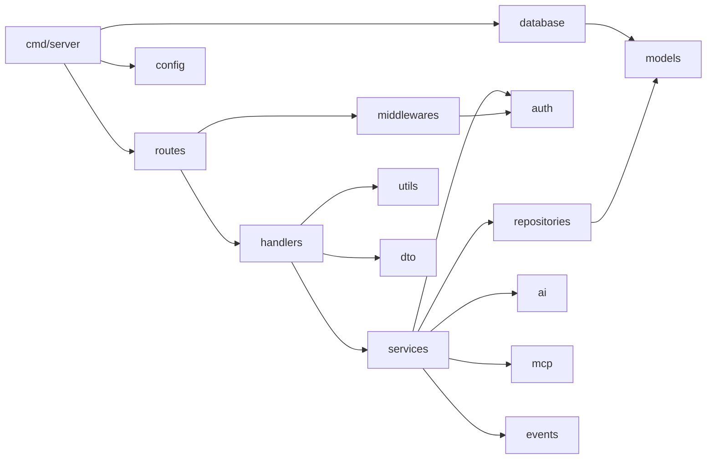

# Modules

Peta modul untuk ketiga aplikasi di monorepo VeroAiTravelAgents. Tiap modul disertai tujuan, file penting, dan ketergantungannya. Gunakan ini untuk menemukan tempat melakukan perubahan tanpa membaca seluruh repo.

## Daftar Isi

- [Backend (Go)](#backend-go)
- [Frontend Customer (Next.js)](#frontend-customer-nextjs)
- [Backoffice (Next.js)](#backoffice-nextjs)
- [Matriks Ketergantungan](#matriks-ketergantungan)

---

## Backend (Go)

Modul Go: `github.com/rozzi/vero-ai-travel-agents/backend`. Pola umum: `Handler -> Service -> Repository -> GORM/PostgreSQL`. Wiring dependency dilakukan manual (tanpa DI framework) di `services.New()` dan `handlers.New()`.

### `cmd/server`
- Tujuan: entry point. Memuat config, validasi, konek DB, AutoMigrate, wiring semua lapisan, daftar rute, jalankan HTTP server dengan graceful shutdown.
- File penting: [`backend/cmd/server/main.go`](../../backend/cmd/server/main.go)
- Bergantung pada: hampir semua paket `internal/*`.
- Catatan: `WriteTimeout: 0` disetel sengaja agar koneksi SSE bisa hidup lama.

### `internal/config`
- Tujuan: memuat environment variable jadi struct `Config`; menyediakan `Validate()` (menolak `JWT_SECRET` default/kosong saat production).
- File penting: [`backend/internal/config/config.go`](../../backend/internal/config/config.go)
- Dipakai oleh: hampir semua modul (config diteruskan lewat value).
- Konstanta penting: `defaultJWTSecret` (dipakai `Validate()` untuk mendeteksi secret default).

### `internal/database`
- Tujuan: koneksi GORM dengan retry 5x + pooling, `AutoMigrate`, migrasi legacy kolom `slots` -> `adult_pax`, dan health check.
- File penting: [`backend/internal/database/database.go`](../../backend/internal/database/database.go)
- Bergantung pada: `config`, `models`.
- Dipakai oleh: `main.go`, `handlers` (untuk health check).

### `internal/models`
- Tujuan: skema GORM seluruh entitas. Berisi `BaseModel` (UUID primary key + soft delete) dan enum `Role`.
- File penting: [`backend/internal/models/models.go`](../../backend/internal/models/models.go)
- Entitas: `User`, `AuthSession`, `ChatSession`, `ChatMessage`, `Trip`, `TripMedia`, `Itinerary`, `Booking`, `Payment`, `AILog`, `ToolCall`.
- Dipakai oleh: `repositories`, `services`, `database`, `handlers`.

### `internal/repositories`
- Tujuan: satu-satunya lapisan yang menyentuh DB. CRUD untuk semua entitas.
- File penting: [`backend/internal/repositories/repositories.go`](../../backend/internal/repositories/repositories.go), [`backend/internal/repositories/auth_sessions.go`](../../backend/internal/repositories/auth_sessions.go)
- Bergantung pada: `models`, `dto` (untuk query struct), GORM.
- Dipakai oleh: `services`.
- Pola: semua method ber-receiver `*Repository`; tidak ada logika bisnis di sini.

### `internal/services`
- Tujuan: SEMUA logika bisnis. Berisi `AuthService`, `MCPService`, `AIService`, `TripService`, `BookingService`, `PaymentService`, `LogService`, `AnalyticsService`.
- File penting: [`backend/internal/services/services.go`](../../backend/internal/services/services.go) (file tunggal ~930 baris)
- Bergantung pada: `repositories`, `auth`, `ai`, `mcp`, `events`, `config`, `dto`, `models`.
- Dipakai oleh: `handlers`.
- Catatan: ini file terpenting & terbesar. Lihat [backend.md](backend.md) untuk rincian tiap service.

### `internal/handlers`
- Tujuan: handler HTTP Gin (parsing request, panggil service, format respons) + dokumentasi OpenAPI/Scalar.
- File penting: [`backend/internal/handlers/handlers.go`](../../backend/internal/handlers/handlers.go), [`backend/internal/handlers/docs.go`](../../backend/internal/handlers/docs.go)
- Bergantung pada: `services`, `database`, `utils`, `dto`, `auth`, `middlewares`, `events`.
- Dipakai oleh: `routes`.

### `internal/routes`
- Tujuan: pendaftaran semua rute + penerapan middleware per-grup (auth, role).
- File penting: [`backend/internal/routes/routes.go`](../../backend/internal/routes/routes.go)
- Bergantung pada: `handlers`, `middlewares`, `services`, `models`.
- Dipakai oleh: `main.go`. Ini sumber kebenaran untuk daftar endpoint.

### `internal/middlewares`
- Tujuan: RequestID, SecureHeaders, CORS, RateLimit (20 req/s), Recovery, `Auth` (verifikasi JWT access), `Role` (RBAC).
- File penting: [`backend/internal/middlewares/middlewares.go`](../../backend/internal/middlewares/middlewares.go)
- Bergantung pada: `auth`, `models`, `utils`.
- Dipakai oleh: `routes`, `main.go`.

### `internal/auth`
- Tujuan: JWTService (sign/parse access & refresh by audience), cookie refresh HttpOnly, audit log keamanan.
- File penting: [`backend/internal/auth/jwt.go`](../../backend/internal/auth/jwt.go), [`backend/internal/auth/cookie.go`](../../backend/internal/auth/cookie.go), [`backend/internal/auth/audit.go`](../../backend/internal/auth/audit.go)
- Bergantung pada: `config`, `models`, `golang-jwt/v5`.
- Dipakai oleh: `services` (AuthService), `middlewares`, `handlers`.

### `internal/ai`
- Tujuan: klien HTTP ke provider OpenAI-compatible (`/chat/completions`) dengan fallback lokal bila API key kosong/gagal.
- File penting: [`backend/internal/ai/openclaw.go`](../../backend/internal/ai/openclaw.go)
- Dipakai oleh: `services` (AIService).

### `internal/mcp`
- Tujuan: katalog definisi tool MCP (metadata + flag `Enabled`).
- File penting: [`backend/internal/mcp/tools.go`](../../backend/internal/mcp/tools.go)
- Dipakai oleh: referensi katalog. Eksekusi tool sebenarnya (mock) ada di `MCPService` dalam `services.go`.

### `internal/events`
- Tujuan: event bus in-memory pub/sub (channel buffered 32, publish non-blocking) untuk SSE.
- File penting: [`backend/internal/events/bus.go`](../../backend/internal/events/bus.go)
- Dipakai oleh: `services` (semua publish event), `handlers` (EventStream subscribe).

### `internal/utils`
- Tujuan: envelope respons API standar `{success, message, data, error}` + helper status (BadRequest, Unauthorized, dst).
- File penting: [`backend/internal/utils/response.go`](../../backend/internal/utils/response.go)
- Dipakai oleh: semua `handlers`.

### `internal/dto`
- Tujuan: struct request/response + tag validasi binding Gin.
- File penting: [`backend/internal/dto/dto.go`](../../backend/internal/dto/dto.go)
- Dipakai oleh: `handlers`, `services`, `repositories` (query struct).

### `internal/payments`
- Tujuan: referensi DOKU. Logika utama pembayaran ada di `PaymentService` (services.go).

---

## Frontend Customer (Next.js)

Lokasi: [`frontend/`](../../frontend). App Router, hanya memakai 2 endpoint backend (chat guest + detail paket). Tidak ada auth.

### `src/app`
- Tujuan: routing App Router.
- File penting:
  - [`frontend/src/app/page.tsx`](../../frontend/src/app/page.tsx) — halaman utama (chat).
  - [`frontend/src/app/trip/[id]/page.tsx`](../../frontend/src/app/trip/[id]/page.tsx) — detail paket; memanggil `GET /api/v1/packages/:id`.
  - [`frontend/src/app/layout.tsx`](../../frontend/src/app/layout.tsx) — root layout.

### `src/components`
- Tujuan: komponen UI.
- File penting:
  - [`frontend/src/components/chat/ChatInterface.tsx`](../../frontend/src/components/chat/ChatInterface.tsx) — inti: kirim prompt ke `POST /api/v1/chat`, render kartu rekomendasi + efek mengetik (client-side, bukan SSE).
  - [`frontend/src/components/cards/RecommendationCard.tsx`](../../frontend/src/components/cards/RecommendationCard.tsx) — kartu paket.
  - [`frontend/src/components/pricing/TripPriceBlock.tsx`](../../frontend/src/components/pricing/TripPriceBlock.tsx) — blok harga.
  - [`frontend/src/components/layout/Sidebar.tsx`](../../frontend/src/components/layout/Sidebar.tsx) — sidebar (beberapa link masih placeholder).

### `src/lib`
- Tujuan: helper.
- File penting:
  - [`frontend/src/lib/api.ts`](../../frontend/src/lib/api.ts) — `apiFetch` envelope-aware, `assetURL`, tipe `TripPackage`.
  - [`frontend/src/lib/format.ts`](../../frontend/src/lib/format.ts) — `formatIDR` (0 → Rp 0; TBD hanya null/undefined/NaN), `getDiscountMeta`, `getTripAdultPrice`/`getTripChildPrice`.
  - `format-trip-pax.ts`, `utils.ts` — formatting pax dan util umum.

---

## Backoffice (Next.js)

Lokasi: [`backoffice-frontend/`](../../backoffice-frontend). App Router, dengan auth penuh (login + refresh proaktif). Fitur aktif: auth + CRUD paket + upload media.

### `src/app`
- Tujuan: routing. Catatan: `/orders`, `/settings`, `/trips/[id]` saat ini hanya me-render layar daftar trip (placeholder).
- File penting:
  - [`backoffice-frontend/src/app/login/page.tsx`](../../backoffice-frontend/src/app/login/page.tsx) — login; verifikasi role backoffice.
  - [`backoffice-frontend/src/app/page.tsx`](../../backoffice-frontend/src/app/page.tsx) — halaman utama (trips list).
  - [`backoffice-frontend/src/app/layout.tsx`](../../backoffice-frontend/src/app/layout.tsx) — root layout (membungkus AppShell).

### `src/components`
- Tujuan: shell + komponen.
- File penting:
  - [`backoffice-frontend/src/components/app-shell.tsx`](../../backoffice-frontend/src/components/app-shell.tsx) — guard auth: verifikasi sesi, redirect login, start scheduler refresh.
  - `components/trips/form/` — form paket berseksi. Lihat [`use-trip-form.ts`](../../backoffice-frontend/src/components/trips/form/use-trip-form.ts) (create/update/upload), `sections/` (9 seksi form), `ui/` (komponen input).
  - `components/trips/list/` — daftar paket. Lihat [`use-trips-list.ts`](../../backoffice-frontend/src/components/trips/list/use-trips-list.ts) (fetch list), `on-development-panel.tsx` (dashboard placeholder).
  - `components/trips/shared/` — sidebar, formatting pax, status tone.

### `src/lib`
- Tujuan: API client + auth.
- File penting:
  - [`backoffice-frontend/src/lib/api.ts`](../../backoffice-frontend/src/lib/api.ts) — inti auth: token storage, refresh proaktif, retry 401, koordinasi antar-tab (BroadcastChannel), logout.
  - [`backoffice-frontend/src/lib/trip.ts`](../../backoffice-frontend/src/lib/trip.ts) — operasi trip (detail, update status, delete).
  - [`backoffice-frontend/src/lib/format.ts`](../../backoffice-frontend/src/lib/format.ts) — `formatIDR`, `getDiscountMeta` (perilaku sama dengan customer frontend).
  - [`backoffice-frontend/src/lib/data.ts`](../../backoffice-frontend/src/lib/data.ts) — mock data (TIDAK terpakai aktif).

---

## Matriks Ketergantungan

Backend (arah panah = "bergantung pada"):

Frontend customer: `app -> components -> lib/api.ts -> backend (2 endpoint)`.

Backoffice: `app -> app-shell -> components/trips/* -> lib/api.ts + lib/trip.ts -> backend (auth + admin packages + uploads)`.

Lihat [architecture.md](architecture.md) untuk alur data end-to-end, dan [api.md](api.md) untuk daftar endpoint lengkap.
